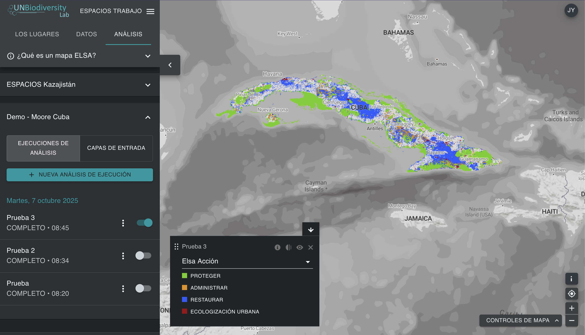

# ¿Para qué sirve la herramienta ELSA?  

La herramienta ELSA permite a diversas partes interesadas evaluar de forma colaborativa las prioridades nacionales para el MMB-KM, explorar compensaciones y sinergias, y desarrollar planes espaciales para apoyar la implementación nacional de las Metas 1, 2 y 3. La herramienta ELSA genera mapas de priorización espacial que identifican las áreas para la protección, la restauración, la gestión y la ecologización urbana que tendrán el mayor impacto en la consecución de las Metas 1-12 del MMB-KM. Los usuarios con un [espacio de trabajo de la UNBL](https://unbiodiversitylab.org/en/unbl-workspaces/) pueden utilizar la herramienta ELSA para ejecutar una priorización espacial nacional personalizada como parte de un proceso participativo de planificación espacial. Pueden: 

  - Mostrar capas de entrada (también conocidas como características de planificación) utilizadas para mapear los objetivos del MMB-KM.  
  - Crear y ejecutar nuevos análisis ELSA con diferentes grupos de partes interesadas. Los usuarios pueden modificar y editar los análisis ELSA de las siguientes maneras:  
    - Modificar el porcentaje del territorio nacional asignado a cada zona de acción basada en la naturaleza, incluyendo la protección (Meta 3 del MMB-KM), la restauración (Meta 2 del MMB-KM), la gestión (Meta 10 del MMB-KM) y/o la ecologización urbana (Meta 12 del MMB-KM). Estas configuraciones pueden adaptarse a los objetivos políticos del país en materia de conservación, restauración y protección, entre otros;  
    - Elegir si se bloquean las áreas protegidas existentes para su protección, asegurándose de que las áreas protegidas existentes se seleccionen dentro del mapa de soluciones.  
    - Editar las ponderaciones de cada una de las capas de entrada (características de planificación) en función de la importancia nacional de la característica cartografiada y la confianza en los datos de entrada.  
    - Editar el parámetro del factor de penalización de los límites para ajustar la cohesión espacial del mapa de acciones.  
  - Ver y descargar los mapas de calor y los mapas de acción resultantes.  
  - Descargar los mapas de calor y los mapas de acción resultantes en formato ráster, que pueden utilizarse para un análisis más detallado según las necesidades de las partes interesadas en el software de sistemas de información geográfica (SIG) de escritorio.  
  - Descargar los resultados y parámetros de un análisis ELSA existente en forma de tabla resumen, disponible en formatos .xlsx, .csv y .json.  

La Herramienta ELSA **no puede** utilizarse para:

  - Añadir capas de datos adicionales para su inclusión como características de planificación o como restricciones de zonificación.  
  - Sustituir directamente las capas de entrada por otras capas de entrada.  
  - Añadir características de bloqueo adicionales.  

Estas modificaciones, así como el desarrollo de análisis personalizados adicionales para satisfacer las necesidades nacionales, están disponibles a través del equipo del UNBL, con recuperación de costos. Para obtener más información y explorar las opciones, póngase en contacto con support@unbiodiversitylab.org.

La herramienta ELSA utiliza el paquete *prioritizr* en su sistema interno como herramienta de optimización espacial para ejecutar un análisis ELSA. *prioritizr* admite una amplia gama de objetivos, restricciones y penalizaciones para crear un análisis personalizado. Las optimizaciones se pueden ejecutar rápidamente en UNBL (a menudo en 3-5 minutos). Por lo tanto, se puede utilizar para generar y perfeccionar planes de conservación en tiempo real durante las reuniones de las partes interesadas, y contribuir a un proceso de toma de decisiones más transparente, inclusivo y participativo para identificar las áreas prioritarias que apoyan la implementación de las Metas 1, 2 y 3 del MMB-KM, con importantes beneficios colaterales para las Metas 4-12.  

!!! note
    Las definiciones de la terminología técnica mencionada en la guía se pueden encontrar en el [Anexo 1](12_annex1.md).

<figure markdown>

<figcaption>Figura 1. Interfaz inicial de la herramienta ELSA en el UNBL</figcaption>
</figure>
