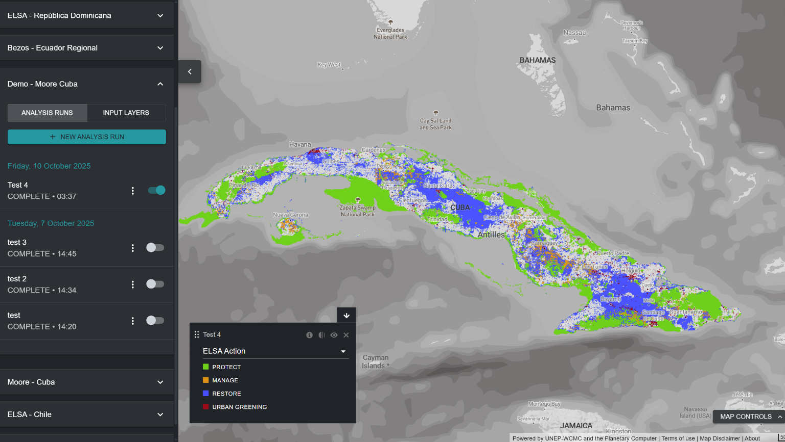

# À quoi sert l'outil ELSA ?

L'outil ELSA permet à diverses parties prenantes d'évaluer de manière collaborative les priorités nationales pour le KMGBF, d'explorer les compromis et les synergies, et de développer des plans spatiaux pour soutenir la mise en œuvre nationale des Objectifs 1, 2 et 3. L'outil ELSA produit des cartes de priorisation spatiale qui identifient les zones de protection, de restauration, de gestion et de verdissement urbain qui auront le plus grand impact pour atteindre les Objectifs 1-12 du KMGBF. Les utilisateurs disposant d'un [espace de travail UNBL](https://unbiodiversitylab.org/en/unbl-workspaces/) peuvent utiliser l'outil ELSA pour exécuter une priorisation spatiale nationale personnalisée dans le cadre d'un processus participatif de planification spatiale. Ils peuvent :

  - Afficher les couches d'entrée (également appelées caractéristiques de planification) utilisées pour cartographier les objectifs du KMGBF.
  - Créer et exécuter de nouvelles exécutions d'analyse ELSA avec différents groupes de parties prenantes. Les utilisateurs peuvent modifier et éditer les exécutions d'analyse ELSA de la manière suivante :
    - Modifier le pourcentage du territoire national alloué à chaque zone d'action basée sur la nature, y compris la protection (Objectif 3 du KMGBF), la restauration (Objectif 2 du KMGBF), la gestion (Objectif 10 du KMGBF) et/ou le verdissement urbain (Objectif 12 du KMGBF). Ces configurations peuvent être adaptées aux objectifs politiques du pays en matière de conservation, de restauration et de protection, entre autres ;
    - Choisir de verrouiller les Aires Protégées existantes pour la protection, garantissant que les Aires Protégées existantes sont sélectionnées dans la carte de solution ;
    - Modifier les poids de chacune des couches d'entrée (caractéristiques de planification) en fonction de l'importance nationale de la caractéristique cartographiée et de la confiance dans les données d'entrée ; et
    - Modifier le paramètre de facteur de pénalité de frontière pour ajuster la cohésion spatiale de la carte d'action.
  - Visualiser et télécharger les cartes thermiques et cartes d'action résultantes.
  - Télécharger les cartes thermiques et cartes d'action résultantes au format raster, qui peuvent être utilisées pour une analyse plus approfondie selon les besoins des parties intéressées dans les logiciels de Systèmes d'Information Géographique (SIG) de bureau.
  - Télécharger les résultats et paramètres d'une exécution d'analyse ELSA existante sous forme de tableau récapitulatif, disponible aux formats .xlsx, .csv et .json.

L'outil ELSA **ne peut pas** être utilisé pour :

  - Ajouter des couches de données supplémentaires pour inclusion soit en tant que caractéristiques de planification, soit en tant que contraintes de zonage.
  - Remplacer directement les couches d'entrée par d'autres couches d'entrée.
  - Ajouter des caractéristiques de verrouillage supplémentaires.

Ces modifications, ainsi que le développement d'analyses personnalisées supplémentaires pour répondre aux besoins nationaux, sont disponibles sur une base de recouvrement des coûts auprès de l'équipe UNBL. Pour en savoir plus et explorer les options, veuillez contacter support@unbiodiversitylab.org.

L'outil ELSA utilise le package *prioritizr* en arrière-plan comme outil d'optimisation spatiale pour exécuter une analyse ELSA. *prioritizr* prend en charge une large gamme d'objectifs, de contraintes et de pénalités pour créer une analyse sur mesure. Les optimisations peuvent être exécutées rapidement sur UNBL (souvent en 3-5 minutes). Il peut donc être utilisé pour générer et affiner des plans de conservation en temps réel lors de réunions de parties prenantes, et contribuer à un processus de prise de décision plus transparent, inclusif et participatif pour identifier les zones prioritaires pour soutenir la mise en œuvre des Objectifs 1, 2 et 3 du KMGBF, avec de puissants co-bénéfices pour les Objectifs 4-12.

!!! note
    Les définitions de la terminologie technique mentionnée dans le guide peuvent être trouvées dans l'[Annexe 1](12_annex1.md).

