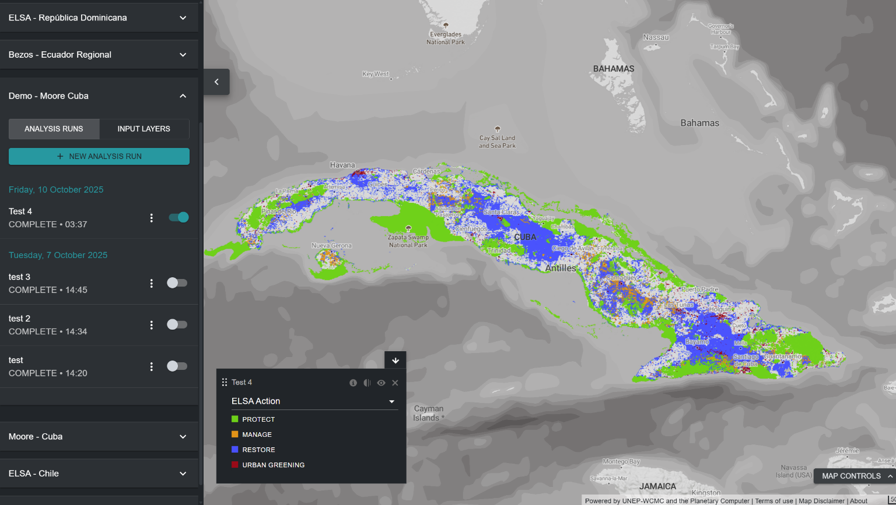

What is the ELSA tool for? 
==========================

The ELSA Tool enables diverse stakeholders to collaboratively assess national priorities for the KMGBF, explore trade-offs and synergies, and develop spatial plans to support national implementation of Targets 1, 2, and 3. The ELSA Tool produces spatial prioritization maps that identify areas for protection, restoration, management, and urban greening that will have the highest impact towards achieving KMGBF Targets 1-12.  Users with a `UNBL workspace <https://unbiodiversitylab.org/en/unbl-workspaces/>`_ can use the ELSA Tool to execute a customized national spatial prioritization as part of a participatory spatial planning process. They can: 

    - Display input layers (also known as planning features)used to map KMGBF targets.
    - Create and execute new ELSA analysis runs with different stakeholder groups. Users can modify and edit ELSA analysis runs in the following ways:  
      - Modify the percentage of national territory allocated for each nature-based action zone including protection (KMGBF Target 3), restoration (KMGBF Target 2), management (KMGBF Target 10), and/or urban greening (KMGBF Target 12). These configurations can be adapted to the country's policy targets for conservation, restoration, and protection, among others; 
      - Choose whether to lock-in existing Protected Areas for protection, ensuring existing Protected Areas are selected within the solution map; 
      - Edit weights of each of the input layers (planning features) based on national importance of the mapped feature and confidence in the input data; and 
      - Edit the boundary penalty factor parameter to adjust spatial cohesion of the action map.
    - View and download resulting heat maps and action maps. 
	- Download resulting heat maps and action maps in raster format, which can be used for further analysis according to the needs of the interested parties in desktop Geographic Information Systems (GIS) software. 
	- Download results and parameters of an existing ELSA analysis run as a summary table, which is available in .xlsx, .csv and .json formats. 

The ELSA Tool **cannot** be used to: 

  - Add additional data layers for inclusion either as planning features or as zoning constraints.  
  - Directly replace input layers with other input layers.  
  - Add additional lock-in features. 

These modifications, as well as further custom analysis development to meet national needs, are available on a cost recovery basis from the UNBL team. To learn more and explore options, please contact support@unbiodiversitylab.org.  

The ELSA Tool uses the *prioritizr* package in the back end as a spatial optimization tool to run an ELSA analysis. *prioritizr* supports a broad range of objectives, constraints and penalties to create a tailored analysis. Optimizations can be executed quickly on UNBL (often within 3-5 minutes). It can therefore be used to generate and refine conservation plans in real-time during stakeholder meetings, and contribute to a more transparent, inclusive, and participatory decision-making process to identify priority areas to support the implementation of KMGBF Targets 1, 2 and 3, with powerful co-benefits for Targets 4-12.  

.. note:: 
  Definitions of technical terminology mentioned in the guidance can be found in :ref:`Annex 1 <annex-1>`. 

   Figure 1. Initial interface of the ELSA Tool on UNBL