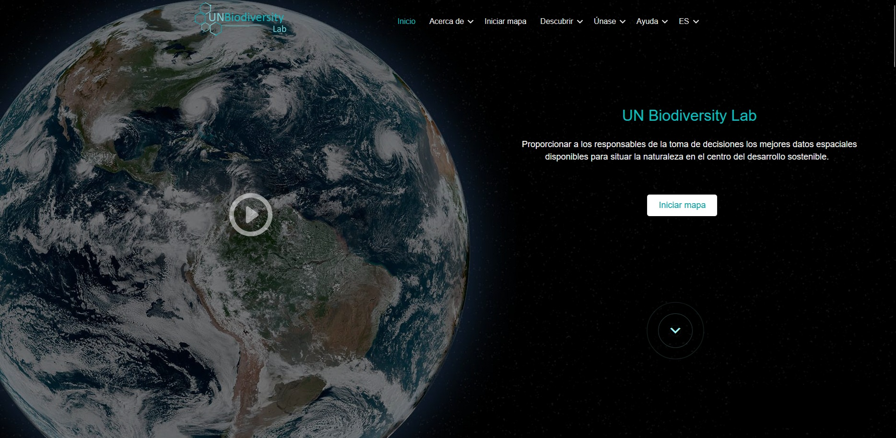
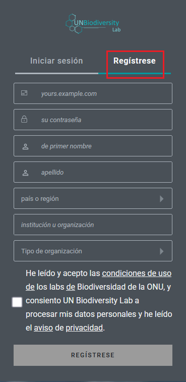
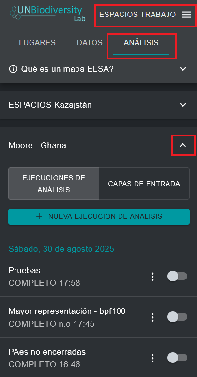

# Registro en el UNBL y solicitud de acceso a un espacio de trabajo con una configuración de la herramienta ELSA  

Para registrarse en el UNBL y solicitar acceso a un espacio de trabajo y a la herramienta ELSA, siga los siguientes pasos.   

1. Haga clic en el botón «Iniciar mapa» en el sitio web [UN Biodiversity Lab](https://unbiodiversitylab.org/es/) para acceder a la aplicación de datos.  

<figure markdown>

<figcaption>Figura 2. Página de inicio del UNBL</figcaption>
</figure>

2. Una vez que se haya cargado, seleccione el icono de la cuenta en la esquina superior derecha y elija «registrarse». Introduzca su correo electrónico, nombre, país e institución (opcional) y establezca su contraseña para registrarse.  

<figure markdown>

<figcaption>Figura 3. Ventana de registro</figcaption>
</figure>

3. Recibirá un correo electrónico en unos minutos. Siga las instrucciones de este correo electrónico para verificar su cuenta.  
4. Una vez verificada su cuenta, podrá iniciar sesión con su dirección de correo electrónico y contraseña cada vez que acceda a la plataforma.  
5. Para utilizar la herramienta ELSA en su país, solo tiene que [solicitar un espacio de trabajo en el UN Biodiversity Lab](https://unbiodiversitylab.org/es/unbl-workspaces/) mediante nuestro formulario e indicar que desea acceder a la herramienta ELSA. Si tiene alguna pregunta, no dude en ponerse en contacto con nosotros al correo <support@unbiodiversitylab.org>.
6. Una vez creado el espacio de trabajo, recibirá un correo electrónico de confirmación. Podrá acceder a él navegando a la aplicación de mapas UNBL, activando el espacio de trabajo en la pestaña que aparece después de hacer clic en la pestaña «ESPACIOS DE TRABAJO» en la parte superior izquierda y haciendo clic en «ANÁLISIS» una vez que haya elegido su espacio de trabajo para ver la herramienta ELSA. Las configuraciones de la herramienta ELSA se pueden crear para uno o varios países dentro de su espacio de trabajo.  
7. Si tiene una o más configuraciones de herramientas en un solo espacio de trabajo, o tiene acceso a varios espacios de trabajo con configuraciones de herramientas, aparecerá una lista de las configuraciones de herramientas disponibles en la pestaña después de hacer clic en «ANÁLISIS». Haga clic en la flecha hacia abajo de la configuración de herramientas que desee utilizar para seleccionar esa configuración. Si solo tiene acceso a una configuración de herramienta o solo tiene un espacio de trabajo con una configuración de herramienta activada, dicha configuración de herramienta se seleccionará automáticamente.  

<figure markdown>

<figcaption>Figura 4. Acceso a la configuración de la herramienta ELSA para Moore (Ghana)</figcaption>
</figure>