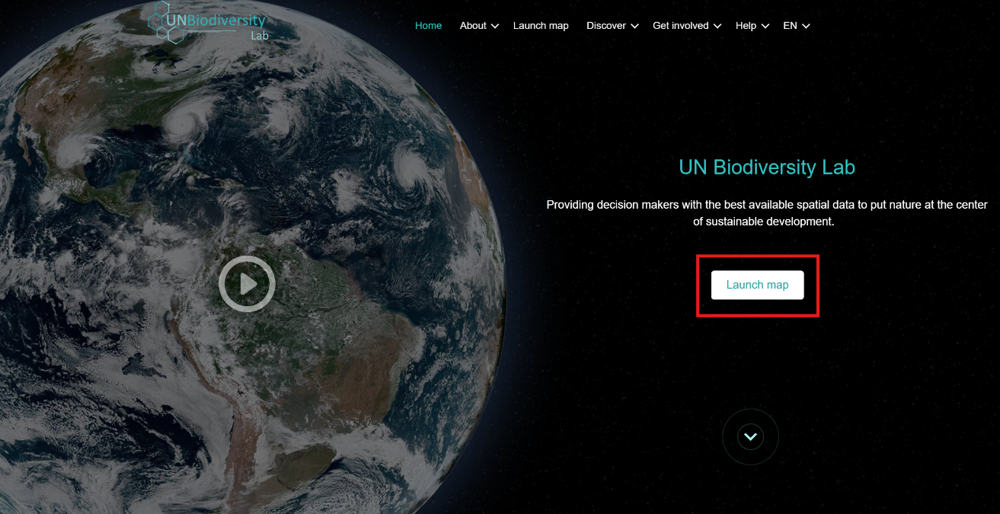
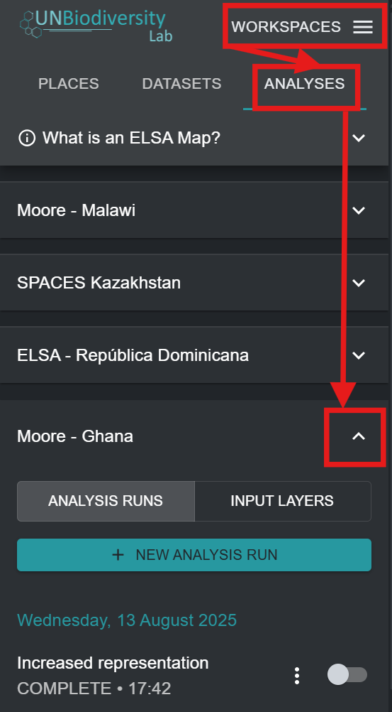

# Inscription sur UNBL et Demande d'Accès à un Espace de Travail avec une Configuration d'Outil ELSA

Pour vous inscrire sur UNBL et demander l'accès à un espace de travail et à l'outil ELSA, veuillez suivre les étapes suivantes.

1. Cliquez sur le bouton 'Launch map' sur le site web du Laboratoire de la Biodiversité de l'ONU pour accéder à l'application de données.

2. Une fois celle-ci chargée, sélectionnez l'icône de compte dans le coin supérieur droit et choisissez 'sign up'. Entrez votre email, nom, pays et institution (facultatif), et définissez votre mot de passe pour vous inscrire.

3. Vous recevrez un email dans quelques minutes. Suivez les instructions dans cet email pour vérifier votre compte.
4. Une fois votre compte vérifié, vous pouvez vous connecter en utilisant votre adresse email et votre mot de passe chaque fois que vous accédez à la plateforme.
5. Pour utiliser l'outil ELSA pour votre pays, il suffit de [demander un espace de travail sur le Laboratoire de la Biodiversité de l'ONU](https://unbiodiversitylab.org/en/unbl-workspaces/) en utilisant notre formulaire et indiquez que vous souhaitez accéder à l'outil ELSA. N'hésitez pas à nous contacter à <support@unbiodiversitylab.org> pour toute question supplémentaire.
6. Une fois l'espace de travail créé, vous recevrez une confirmation par email. Vous pourrez y accéder en naviguant vers l'application de carte UNBL, en basculant l'espace de travail dans l'onglet qui apparaît après avoir cliqué sur l'onglet 'WORKSPACES' en haut à gauche, et en cliquant sur 'ANALYSES' une fois que vous avez choisi votre espace de travail pour visualiser l'outil ELSA. Les configurations d'outil ELSA peuvent être créées pour un ou plusieurs pays dans votre espace de travail.
7. Si vous avez une ou plusieurs configurations d'outil dans un seul espace de travail, ou avez accès à plusieurs espaces de travail avec des configurations d'outil, alors une liste des configurations d'outil disponibles apparaîtra dans l'onglet après avoir cliqué sur 'ANALYSES'. Cliquez sur la flèche vers le bas de la configuration d'outil que vous souhaitez utiliser pour sélectionner cette configuration d'outil. Si vous n'avez accès qu'à une seule configuration d'outil ou n'avez qu'un seul espace de travail avec une configuration d'outil basculée, alors cette configuration d'outil sera automatiquement sélectionnée.

