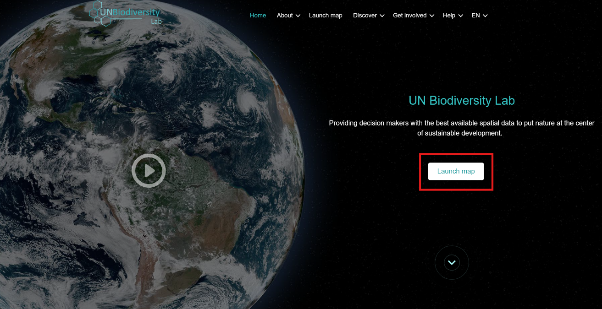

# Registering on UNBL and Requesting Access to a Workspace with an ELSA Tool Configuration

To register on UNBL and request access to a workspace and ELSA Tool, please undertake the following steps.

1. Click the ‘Launch map’ button on the UN Biodiversity Lab website to access the data app.

*Figure 2. UNBL home page*

2. Once this has loaded, select the account icon in the top right-hand corner and choose ‘sign up’. Enter your email, name, country, and institution (optional), and set your password to sign up. 

.. figure:: images/image003.png
   :alt: Figure 3. Sign up window 
   :align: center
   

*Figure 3. Sign up window*

3. You will receive an email within a few minutes. Follow the instructions in this email to then follow the email to verify your account.  
4. Once your account is verified, you can log-in using your email address and password each time you access the platform. 
5. To use the ELSA Tool for your country, simply [request a workspace on UN Biodiversity Lab ](https://unbiodiversitylab.org/en/unbl-workspaces/) using our form and indicate that you would like access to the ELSA Tool. Feel free to reach out to us at support@unbiodiversitylab.org for further questions. 
6. Once the workspace has been created, you will receive email confirmation. You will be able to access it by navigating to the UNBL map app, toggling the workspace in the tab that appears after clicking on the ‘WORKSPACES’ tab in the top-left, and clicking on ‘ANALYSES’ once you have chosen your workspace to view the ELSA Tool. ELSA Tool configurations can be created for one or multiple countries within your workspace.  
7. If you have one or more tool configurations in a single workspace, or have access to multiple workspaces with tool configurations, then a list of the available tool configurations will appear in the tab after you click on ‘ANALYSES’. Click on the downward arrow of the tool configuration you wish to use to select that tool configuration. If you only have access to one tool configuration or only have one workspace with one tool configuration toggled, then that tool configuration will automatically be selected. 

*Figure 4. Accessing the ELSA Tool configuration for Moore – Ghana*