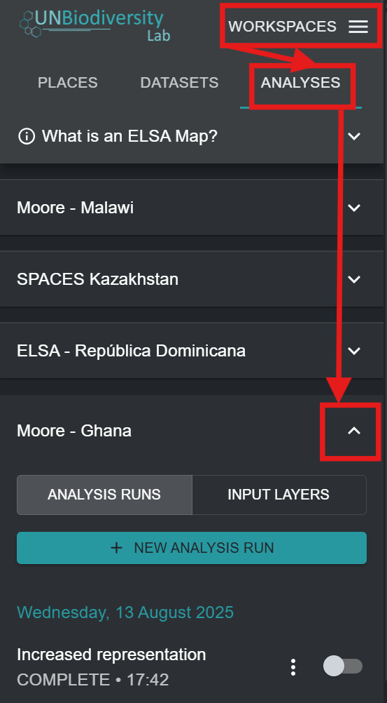

# Registrando-se na UNBL e Solicitando Acesso a um Espaço de Trabalho com uma Configuração de Ferramenta ELSA

Para se registrar na UNBL e solicitar acesso a um espaço de trabalho e à Ferramenta ELSA, siga as seguintes etapas.

1. Clique no botão 'Launch map' no site do Laboratório de Biodiversidade da ONU para acessar o aplicativo de dados.

2. Depois que carregar, selecione o ícone de conta no canto superior direito e escolha 'sign up'. Insira seu e-mail, nome, país e instituição (opcional) e defina sua senha para se registrar.

3. Você receberá um e-mail em alguns minutos. Siga as instruções neste e-mail para verificar sua conta.
4. Depois que sua conta for verificada, você pode fazer login usando seu endereço de e-mail e senha cada vez que acessar a plataforma.
5. Para usar a Ferramenta ELSA para seu país, basta [solicitar um espaço de trabalho no Laboratório de Biodiversidade da ONU](https://unbiodiversitylab.org/en/unbl-workspaces/) usando nosso formulário e indique que deseja acesso à Ferramenta ELSA. Sinta-se à vontade para entrar em contato conosco em <support@unbiodiversitylab.org> para perguntas adicionais.
6. Depois que o espaço de trabalho for criado, você receberá uma confirmação por e-mail. Você poderá acessá-lo navegando até o aplicativo de mapa UNBL, alternando o espaço de trabalho na aba que aparece depois de clicar na aba 'WORKSPACES' no canto superior esquerdo e clicando em 'ANALYSES' depois de escolher seu espaço de trabalho para visualizar a Ferramenta ELSA. As configurações da Ferramenta ELSA podem ser criadas para um ou vários países dentro do seu espaço de trabalho.
7. Se você tiver uma ou mais configurações de ferramenta em um único espaço de trabalho, ou tiver acesso a vários espaços de trabalho com configurações de ferramenta, então uma lista das configurações de ferramenta disponíveis aparecerá na aba depois de clicar em 'ANALYSES'. Clique na seta para baixo da configuração de ferramenta que deseja usar para selecionar essa configuração de ferramenta. Se você tiver acesso a apenas uma configuração de ferramenta ou tiver apenas um espaço de trabalho com uma configuração de ferramenta alternada, então essa configuração de ferramenta será automaticamente selecionada.

