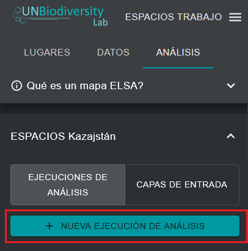

# Crear una nueva ejecución de análisis

Una vez que haya seleccionado una herramienta ELSA específica en el menú desplegable de la figura 4, puede crear una nueva ejecución de análisis. Para ello, haga clic en el botón «NUEVA EJECUCIÓN DE ANÁLISIS». Aparecerá una ventana emergente con la estructura de optimización estándar de ELSA y todos los parámetros ELSA relevantes listos para su edición (véase la [figura 5](#fig-create-new-analysis)).

!!! important
    Los usuarios no pueden crear ni editar configuraciones de la herramienta ELSA. Solo pueden crear o editar ejecuciones de análisis dentro de una configuración de la herramienta ELSA. Para solicitar una configuración de la herramienta ELSA para un país específico, póngase en contacto con <support@unbiodiversitylab.org>.

<figure markdown>
{#fig-create-new-analysis}
<figcaption> Figure 5. Crear una nueva ejecución de análisis</figcaption>
</figure>