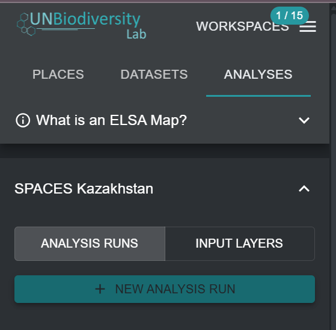

Creating new ELSA analysis runs
===============================

Once you have selected a specific ELSA Tool from the drop-down in Figure 4, you can create a new analysis run. To do this, click on the ‘NEW ANALYSIS RUN’ button. A pop-up window will appear with the standard ELSA optimization structure and all relevant ELSA parameters ready for editing (see Figure 5). 

.. important::
   
   Users cannot create or edit ELSA Tool configurations. They can only create or edit analysis runs within an ELSA Tool configuration. To request an ELSA Tool configuration for a specific country, please contact support@unbiodiversitylab.org.

   
   Figure 5. Creating a new analysis run
