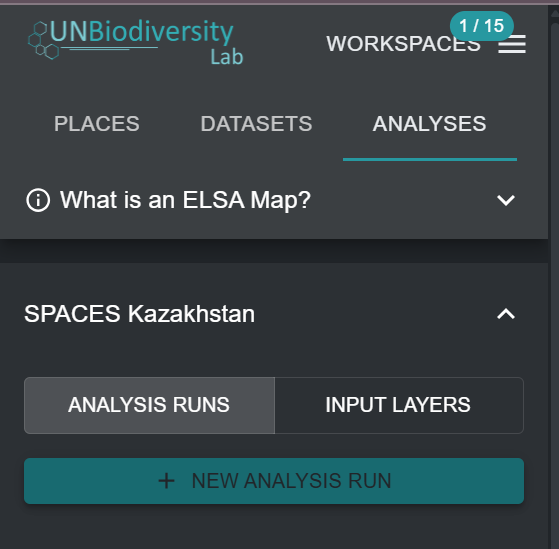

# Создание новых запусков анализа ELSA

После выбора конкретного Инструмента ELSA из выпадающего меню на Рисунке 4, вы можете создать новый запуск анализа. Для этого нажмите кнопку 'NEW ANALYSIS RUN'. Появится всплывающее окно со стандартной структурой оптимизации ELSA и всеми соответствующими параметрами ELSA, готовыми для редактирования (см. [Рисунок 1](#fig-create-new-analysis)).

!!! important
    Пользователи не могут создавать или редактировать конфигурации Инструмента ELSA. Они могут только создавать или редактировать запуски анализа в рамках конфигурации Инструмента ELSA. Чтобы запросить конфигурацию Инструмента ELSA для конкретной страны, свяжитесь с <support@unbiodiversitylab>.org.

{#fig-create-new-analysis}
