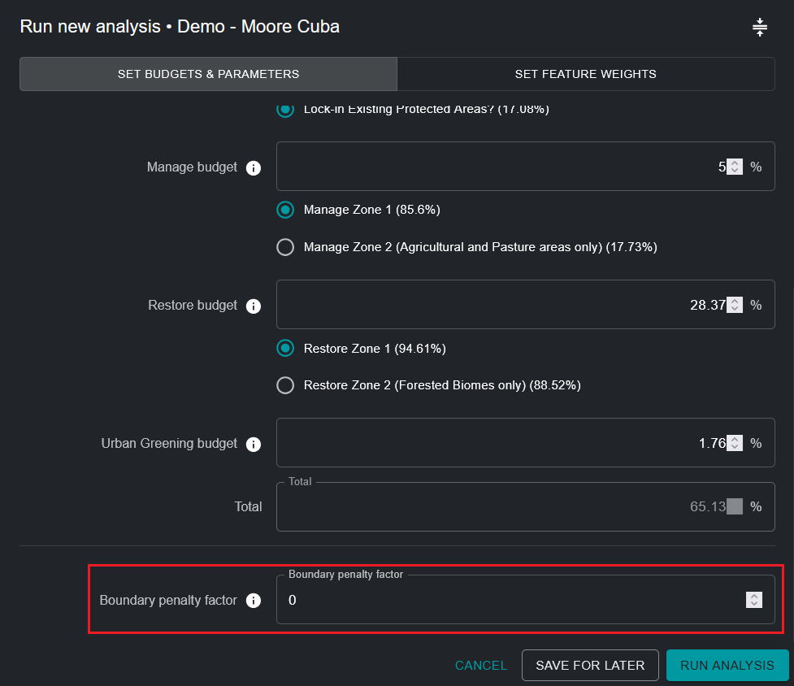

# Editar una ejecución de análisis ELSA

!!! info "Conceptos Clave"
    * [Zonas de Acción](12_annex1.md#action-zones)
    * [Características de Bloqueo](12_annex1.md#lock-in-features)
    * [Restricción basada en área](12_annex1.md#area-based-constraint)
    * [Factor de Penalización de Límites (BPF)](12_annex1.md#boundary-penalty-factor-bpf)
    * [Característica de planificación](12_annex1.md#planning-feature)
    * [Unidades de planificación](12_annex1.md#planning-units)
    * [Software de apoyo a la decisión](12_annex1.md#decision-support-software)
    * [Sistema de Información Geográfica (SIG)](12_annex1.md#geographic-information-system-gis)
    * [Restricciones](12_annex1.md#restrictions)
    * [Representación](12_annex1.md#representation)
    * [Planificación Sistemática de la Conservación (SCP)](12_annex1.md#systematic-conservation-planning-scp)
    * [Interfaz de usuario](12_annex1.md#user-interface)
    * [Pesos](12_annex1.md#weights)

## Nombrar la ejecución de análisis ELSA

Al hacer clic en 'NEW ANALYSIS RUN' (Figura 5), podrá ver y editar un análisis tentativo. Primero, debe proporcionar un nombre nuevo y único para su ejecución de análisis. Si bien no hay restricciones sobre el nombre dado a cada ejecución, sugerimos que los nombres de las ejecuciones deben incluir descripciones significativas, idealmente haciendo referencia a los parámetros utilizados (por ejemplo, incluir información como, BPF 10, o Proteger 38%).

## Seleccionar funciones de bloqueo

Puede asegurar que ciertas áreas estén incluidas en su mapa de acción. Conceptualmente, esto se entiende más fácilmente como el bloqueo de áreas de planificación existentes a la acción de protección en un mapa, en esencia replicando las realidades sobre el terreno. Esto obliga a que estas áreas sean seleccionadas dentro de la acción de protección en el mapa, y estas áreas se ven obligadas a contribuir a cumplir con la restricción de área para protección. La cobertura de área protegida nacional (%) se muestra entre paréntesis. Las configuraciones de herramientas no solo se limitan a bloquear áreas protegidas existentes a la acción de protección (por ejemplo, podría ser deseable bloquear áreas de proyectos de restauración existentes a la acción de restauración); sin embargo, por defecto, las configuraciones de herramientas actualmente solo están configuradas para permitir el bloqueo de áreas protegidas.

!!! important
    Las Áreas Protegidas están bloqueadas **POR DEFECTO**

Bloqueo de Áreas Protegidas ([Figura 1](#fig-lockin-options)):

* Seleccione 'Lock-in Existing Protected Areas' si desea forzar el análisis a incluir Áreas Protegidas existentes dentro de la acción de 'Protección' en la solución.
* Seleccione 'Lock-in nothing' si desea evaluar independientemente la ubicación óptima de Áreas Protegidas existentes y nuevas en su país según las áreas de 'Protección' seleccionadas en el mapa de acción resultante.

{#fig-lockin-options}

Como se ve en la [Figura 1](#fig-lockin-options) para Cuba, las Áreas Protegidas existentes cubren el 17.08% del país. Por lo tanto, la selección de 'Lock-in Existing Protected Areas' requiere que al menos el 17.08% del territorio nacional sea asignado bajo la restricción de área de 'Protección'.

## Zonas Alternativas

Los usuarios no pueden definir zonas por sí mismos, pero para algunas acciones, puede haber tanto una zona predeterminada como una zona alternativa que se puede seleccionar. Por ejemplo, algunas herramientas pueden tener una opción para considerar "Solo áreas agrícolas" para la acción de gestión, o "Solo áreas forestales" para la acción de restauración, según las necesidades y prioridades individuales de los usuarios y países.

{#fig-alt-zone-options}

## Establecer restricciones basadas en área para acciones

Esta parte de la herramienta le permite establecer restricciones (objetivos) basadas en área para protección, restauración, gestión y/o revegetación urbana. Las restricciones de área también se pueden entender como el porcentaje de área de tierra que debe darse a cada acción en el mapa de acción resultante. Los valores predeterminados en cualquier Herramienta ELSA dada se derivan de los objetivos terrestres en el KMGBF, a menos que se personalicen aún más para su país por el equipo de UNBL basándose en su Estrategia y Plan de Acción Nacional sobre Biodiversidad (NBSAP) u otros documentos de política nacional.

Puede establecer cualquier valor mayor o igual a 0.001 para objetivos de protección, restauración, gestión y/o revegetación urbana. La suma del valor para todos los objetivos puede ser menor o igual al 100%, pero no debe exceder el 100%. Además, el valor máximo para cualquier restricción de área única no puede exceder el área total de esa zona de acción. Por ejemplo, si el 80% de un país está cubierto por una zona de protección, entonces el valor máximo que se puede asignar para la restricción basada en área para protección no puede exceder el 80%. Si ingresa un número que es demasiado alto, recibirá un error especificando la cantidad máxima que se puede asignar.

!!! note
    Nota: La ubicación y el área total de cada zona de acción define dónde es posible que se lleve a cabo cada acción. Se determina en función del tipo de ecosistema y el nivel de desarrollo en un país (por ejemplo, la protección no puede tener lugar en áreas con un alto índice industrial humano).

También debe considerar que si desea bloquear Áreas Protegidas existentes (la opción predeterminada), la restricción de área de protección general debe ser igual o mayor que el área de tierra cubierta por Áreas Protegidas existentes. Por ejemplo, el área de tierra cubierta por Áreas Protegidas existentes en Cuba es del 17.08%. Por lo tanto, la restricción de área de protección debe ser igual o mayor al 17.08%.

{#fig-setting-objectives}

## Especificar el factor de penalización de límites

El factor de penalización de límites se utiliza para promover la cohesión espacial al priorizar zonas de uso de la tierra. La penalización de límites puede ser 0 o mayor. Cuanto mayor sea el valor, más conectadas y contiguas serán las zonas de acción en el mapa. Este ajuste se basa en la idea de que, para la planificación en el mundo real, una zona más conectada suele ser más fácil de gestionar y ejecutar acciones.

Pasos:

1. Para establecer la penalización de límites, comience con un número pequeño, por ejemplo, 10.
2. Aumente el número iterativamente, es decir, vuelva a ejecutar el análisis repetidamente, en un orden de magnitud (por ejemplo, 10 -> 100-> 1000), reduciendo la tasa de aumento a medida que se acerca a soluciones que conducen a su nivel deseado de agrupamiento. Cada vez que cambie la penalización, tendrá que volver a ejecutar la optimización hasta que llegue a un mapa que sea lo suficientemente contiguo para satisfacer sus necesidades.

!!! attention
    Aumentar el factor de penalización de límites desde 0 resultará en tiempos de resolución más largos; en algunos casos, estos pueden ser mucho más largos.

{#fig-adjust-bpf}

## Editar los pesos de las características de planificación

Para editar los pesos de las características de planificación, haga clic en el botón 'SET FEATURE WEIGHTS' cerca de la esquina superior derecha de la ventana emergente de ejecución de análisis.

Debe ingresar un peso para cada característica de planificación en la lista de datos de entrada. Recomendamos una escala de 0 a 10 de la siguiente manera, según el nivel de prioridad de cada característica de planificación y su confianza en la precisión del conjunto de datos para su país:

* 0 - no es importante / excluido del análisis
* 1.0 - baja importancia / menor importancia que el promedio
* 5.0 - importancia media
* 10 - máxima importancia

Para permitir que los usuarios tomen la decisión más informada posible, el tema (biodiversidad/cambio climático/bienestar humano), acciones relevantes y el objetivo de política del KMGBF proxy (u otro objetivo de política nacional/NBSAP relevante) se enumeran para cada característica de planificación. Puede evaluar el nivel de prioridad de cada característica de planificación y asignar un peso informado decidiendo sobre la importancia relativa de cada una de las características de planificación utilizadas para mapear los objetivos del KMGBF (u otros objetivos de política nacional/NBSAP relevantes definidos de otra manera por su país) en su país. Por ejemplo, si el Objetivo 1 del KMGBF es de especial importancia para su país, entonces las características de planificación como ecosistemas intactos, bosques de alta integridad, índice de hábitat de biodiversidad e índice de integridad de biodiversidad deben recibir mayor peso (> 3). Alternativamente, si cree que los ecosistemas amenazados en su país están particularmente degradados y deben considerarse para identificar áreas prioritarias para restauración para el Objetivo 2 del KMGBF, entonces puede dar un peso mayor a la característica de planificación 'Ecosistemas Amenazados para Restauración' que mapea específicamente estas áreas (ver [Figura 5](#fig-edit-weights)).

Para obtener una lista completa de datos de entrada, así como qué objetivos del KMGBF se utilizan para mapear, consulte el [Anexo 2](13_annex2.md).

{#fig-edit-weights}

## Ver capas de entrada

Si desea ver las características de planificación antes de establecer pesos, tendrá que salir de la ventana emergente haciendo clic en 'SAVE FOR LATER' en la esquina inferior derecha. Luego puede volver a su ejecución de análisis de borrador guardada después de ver las características de planificación deseadas.

Para ver las características de planificación, haga clic en la opción 'INPUT LAYERS' junto a la opción 'ANALYSIS RUNS' en la pestaña de herramientas de la izquierda. Luego puede alternar capas de entrada específicas para verlas en UNBL.

Al hacer clic en la pestaña 'INPUT LAYERS', puede ver cada capa individual de característica de planificación de entrada incluida en el análisis ELSA; estas entradas están específicamente adaptadas para ayudar a identificar áreas prioritarias para la implementación del KMGBF, así como la implementación de NBSAP/otra política nacional, si lo solicita específicamente su país. Además, puede ver características de bloqueo (opcionales) (a saber, áreas protegidas existentes) en su país. Finalmente, puede ver la capa para cada zona de acción que define dónde es posible que se lleve a cabo cada acción en su país para el análisis.

Pasos:

* Haga clic en el botón de alternancia para cada zona de acción/zona de bloqueo/capa de característica de planificación de entrada que desea mostrar.
* Haga clic en el botón de alternancia nuevamente para eliminar la capa seleccionada de la vista.
* Tiene la opción de ver información adicional (descripción de la capa, capas de entrada originales, fuente) para las capas actualmente alternadas haciendo clic en el icono redondo '**i**' ya sea en la leyenda de la capa individual o junto al botón de alternancia para cada capa.

