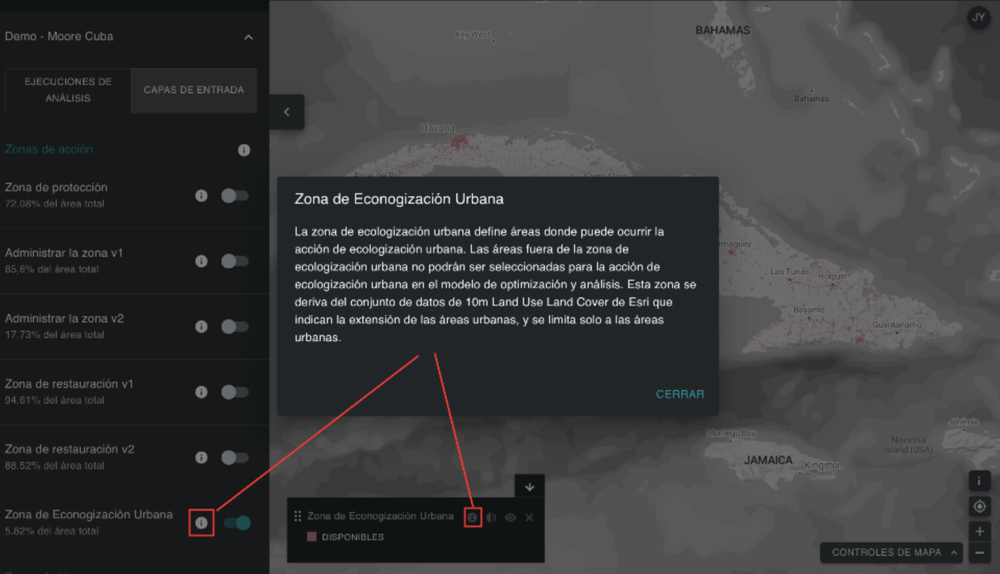

# Edición de una ejecución de análisis ELSA 

!!! info "Términos clave"
    * [Zonas de acción](12_annex1.md#action-zones)
    * [Características de bloqueo](12_annex1.md#lock-in-features)
    * [Restricción basado en el área](12_annex1.md#area-based-constraint)
    * [Factor de penalización de los límites (BPF)](12_annex1.md#boundary-penalty-factor-bpf)
    * [Característica de planificación](12_annex1.md#planning-feature)
    * [Unidades de planificación](12_annex1.md#planning-units)
    * [Software de apoyo a la toma de decisiones](12_annex1.md#decision-support-software)
    * [Sistema de información geográfica (SIG)](12_annex1.md#geographic-information-system-gis)
    * [Restricciones](12_annex1.md#restrictions)
    * [Representación](12_annex1.md#representation)
    * [Planificación Sistemática de la Conservación (PSC)](12_annex1.md#systematic-conservation-planning-scp)
    * [Interfaz de usuario](12_annex1.md#user-interface)
    * [Ponderación](12_annex1.md#weights)

## Asignación de un nombre a una ejecución de análisis ELSA  

Al hacer clic en «NUEVA EJECUCIÓN DE ANÁLISIS» ([Figura 5](#fig-create-new-analysis)), podrá ver y editar un análisis provisional. En primer lugar, debe proporcionar un nombre nuevo y único para su ejecución de análisis. Aunque no hay restricciones en cuanto al nombre que se le da a cada ejecución, sugerimos que los nombres de las ejecuciones incluyan descripciones significativas, idealmente haciendo referencia a los parámetros utilizados (por ejemplo, incluir información como BPF 10 o Protección 38 %).

## Selección de funciones de bloqueo  

Puede asegurarse de que determinadas áreas se incluyan en su mapa de acción. Conceptualmente, esto se entiende más fácilmente como el bloqueo de las áreas de planificación existentes para la acción de protección en un mapa, esencialmente replicando las realidades en territorio. Esto obliga a seleccionar estas áreas dentro de la acción de protección en el mapa, y estas áreas se ven obligadas a contribuir al cumplimiento de las restricciones de protección de la zona. La cobertura nacional de áreas protegidas (%) se muestra entre paréntesis. Las configuraciones de la herramienta no se limitan únicamente a fijar las áreas protegidas existentes a la acción de protección (por ejemplo, podría ser conveniente fijar las áreas de proyectos de restauración existentes a la acción de restauración); sin embargo, por defecto, las configuraciones de la herramienta solo permiten fijar áreas protegidas.   

!!! important
    Las áreas protegidas están bloqueadas **POR DEFECTO**

Bloqueo de áreas protegidas ([Figura 6](#fig-lockin-options)):

* Seleccione «Bloquear áreas protegidas existentes» si desea forzar el análisis para incluir las áreas protegidas existentes dentro de la acción «Protección» en la solución.  
* Seleccione «No bloquear nada» si desea evaluar de forma independiente la ubicación óptima de las áreas protegidas existentes y nuevas en su país basándose en las áreas «Proteger» seleccionadas en el mapa de acciones resultante.  

<figure markdown>
{#fig-lockin-options}
<figcaption>Figura 6. Funcionalidades de bloqueo</figcaption>
</figure>

Como se ve en la [figura 6](#fig-lockin-options) para Cuba, las áreas protegidas existentes cubren el 17,08 % del país. Por lo tanto, la selección de «Bloquear áreas protegidas existentes» requiere que al menos el 17,08 % del territorio nacional se asigne bajo la restricción de área «Proteger»..   

## Zonas alternativas

Los usuarios no pueden definir las zonas por sí mismos, pero para algunas acciones puede haber tanto una zona predeterminada como una zona alternativa que se puede seleccionar. Por ejemplo, algunas herramientas pueden tener la opción de considerar «Solo zonas agrícolas» para la acción de gestión, o «Solo zonas forestales» para la acción de restauración, en función de las necesidades y prioridades individuales de los usuarios y los países. 

<figure markdown>
{#fig-alt-zone-options}
<figcaption>Figura 7. Zonas alternativas para reducir las áreas de actividad basadas en la naturaleza</figcaption>
</figure>

## Establecimiento de restricciones basadas en el área para las acciones

Esta parte de la herramienta le permite establecer restricciones basadas en el área (objetivos) para la protección, restauración, gestión y/o ecologización urbana. Las restricciones de área también pueden entenderse como el porcentaje de superficie terrestre que debe asignarse a cada acción en el mapa de acciones resultante. Los valores predeterminados en cualquier herramienta ELSA se derivan de los objetivos terrestres del MMB-KM, a menos que el equipo de la UNBL los personalice para su país basándose en su Estrategia Nacional de Biodiversidad y Plan de Acción (ENBPA) u otros documentos de política nacional. 

Puede establecer cualquier valor superior o igual a 0,001 para los objetivos de protección, restauración, gestión y/o ecologización urbana del valor de todos los objetivos puede ser inferior o igual al 100 %, pero no debe superar el 100 %. Además, el valor máximo para cualquier restricción de área individual no puede exceder el área total de esa zona de acción. Por ejemplo, si el 80 % de un país está cubierto por una zona de protección, entonces el valor máximo que se puede asignar para la restricción basada en el área para la protección no puede exceder el 80 %. Si ingresa un número demasiado alto, recibirá un error que especifica la cantidad máxima que se puede asignar. 

!!! note
    Nota: La ubicación y el área total de cada zona de acción definen dónde es posible llevar a cabo cada acción. Se determina en función del tipo de ecosistema y el nivel de desarrollo de un país (por ejemplo, la protección no puede llevarse a cabo en áreas con un alto índice industrial humano).

También debe tener en cuenta que, si desea bloquear las áreas protegidas existentes (el valor predeterminado), la restricción del área de protección total debe ser igual o superior a la superficie cubierta por las áreas protegidas existentes. Por ejemplo, la superficie cubierta por las áreas protegidas existentes en Kazajistán es del 17,08 %. Por lo tanto, la restricción del área de protección debe ser igual o superior al 17,08 %.  

<figure markdown>
{#fig-setting-objectives}
<figcaption>Figura 8. Establecer objetivos</figcaption>
</figure>

## Especificación del factor de penalización por límites  

El factor de penalización por límites se utiliza para promover la cohesión espacial al priorizar las zonas de uso del suelo. La penalización por límites puede ser 0 o superior. Cuanto mayor sea el valor, más conectadas y contiguas serán las zonas de acción en el mapa. Este ajuste se basa en la idea de que, para la planificación en el mundo real, una zona más conectada suele ser más fácil de gestionar y ejecutar acciones.  

Pasos:

1. Para establecer la penalización por límite, comience con un número pequeño, por ejemplo, 10.  
2. Aumente el número de forma iterativa, es decir, vuelva a ejecutar el análisis repetidamente, por un orden de magnitud (por ejemplo, 10 -> 100-> 1000), reduciendo la tasa de aumento a medida que se acerque a las soluciones que le llevan al nivel de agrupación deseado. Cada vez que cambie la penalización, tendrá que volver a ejecutar la optimización hasta llegar a un mapa que sea lo suficientemente contiguo como para satisfacer sus necesidades.  

!!! attention
    Aumentar el factor de penalización de los límites desde 0 dará lugar a tiempos de resolución más largos; en algunos casos, estos pueden ser mucho más largos.  

<figure markdown>
{#fig-adjust-bpf}
<figcaption>Figura 9. Ajuste del factor de penalización de los límites</figcaption>
</figure>

## Edición de las ponderaciones de las características de planificación  

Para editar las ponderaciones de las características de planificación, haga clic en el botón «ESTABLECER PONDERACIONES DE CARACTERÍSTICAS» situado en la esquina superior derecha de la ventana emergente de ejecución del análisis.   

Debe introducir una ponderación para cada característica de planificación en la lista de datos de entrada. Recomendamos una escala de 0 a 10, basada en el nivel de prioridad de cada característica de planificación y en su confianza en la precisión del conjunto de datos de su país:   

* 0: no importante/excluido del análisis
* 1,0: importancia baja/importancia inferior a la media 
* 5,0: importancia media 
* 10: máxima importancia 

Para que los usuarios puedan tomar la decisión más informada posible, se enumeran el tema (biodiversidad/cambio climático/bienestar humano), las acciones pertinentes y el objetivo político del MMB-KM sustitutivo (u otro objetivo político nacional/ENBPA pertinente) para cada característica de planificación. Puede evaluar el nivel de prioridad de cada característica de planificación y asignarle una ponderación informada decidiendo la importancia relativa de cada una de las características de planificación utilizadas para trazar los objetivos MMB-KM (u otros objetivos NBSAP/políticas nacionales relevantes definidos de otro modo por su país) en su país. Por ejemplo, si la meta 1 del MMB-KM es de especial importancia para su país, entonces se debe dar mayor peso (> 3) a características de planificación como los ecosistemas intactos, los bosques de alta integridad, índice de hábitats de biodiversidad e índice de integridad de la biodiversidad. Por otra parte, si cree que los ecosistemas amenazados de su país están especialmente degradados y deben tenerse en cuenta para identificar las áreas prioritarias para la restauración de la Meta 2 del MMB-KM, puede asignar una ponderación mayor a la característica de planificación «Ecosistemas amenazados para la restauración», que cartografía específicamente estas áreas ([Figura 10](#fig-edit-weights)).

Para obtener una lista completa de los datos de entrada, así como de las Metas del MMB-KM para los que se utilizan, consulte el [anexo 2](13_annex2.md).

<figure markdown>
{#fig-edit-weights}
<figcaption>Figura 10. Edición de ponderaciones</figcaption>
</figure>

## Ver capas de entrada

Si desea ver las características de planificación antes de establecer las ponderaciones, tendrá que salir de la ventana emergente haciendo clic en «GUARDAR PARA MÁS TARDE» en la esquina inferior derecha. A continuación, podrá volver a su borrador de análisis guardado después de ver las características de planificación deseadas.   

Para ver las características de planificación, haga clic en la opción «CAPAS DE ENTRADA» junto a la opción «ANÁLISIS EJECUTADOS» en la pestaña de herramientas de la izquierda. A continuación, puede alternar entre capas de entrada específicas para verlas en UNBL.   

<figure markdown>

<figcaption> Figura 11. Visualización de zonas de acción y características de planificación en el UNBL</figcaption>
</figure>

Al hacer clic en la pestaña «CAPAS DE ENTRADA», puede ver cada capa de características de planificación de entrada individual incluida en el análisis ELSA; estas entradas están específicamente diseñadas para ayudar a identificar las áreas prioritarias para la implementación de MMB-KM, así como la implementación de la ENBPA/otras políticas nacionales, si su país lo solicita específicamente. Además, puede ver (opcionalmente) las características de bloqueo (es decir, las áreas protegidas existentes) en su país. Por último, puede ver la capa de cada zona de acción que define dónde es posible llevar a cabo cada acción en su país para el análisis.   

Pasos:

* Haga clic en el botón de activación de cada zona de acción/zona bloqueada/capa de características de planificación de entrada que desee mostrar.  
* Vuelva a hacer clic en el botón de activación para eliminar la capa seleccionada de la vista.  
* Tiene la opción de ver información adicional (descripción de la capa, capas de entrada originales, fuente) para las capas actualmente activadas haciendo clic en el icono redondo «i» en la leyenda de la capa individual o junto al botón de activación de cada capa. 

<figure markdown>

<figcaption> Figura 12. Visualización de metadatos</figcaption>
</figure>
