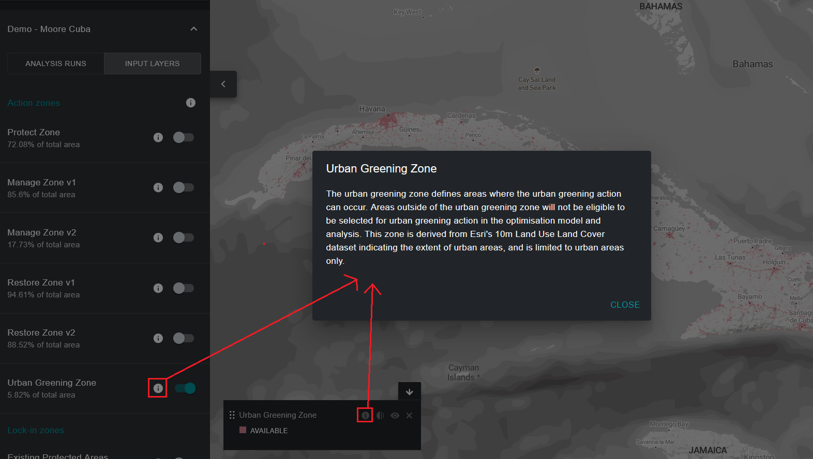

# Modifier une exécution d'analyse ELSA

!!! info "Concepts Clés"
    * [Zones d'Action](12_annex1.md#action-zones)
    * [Caractéristiques de Verrouillage](12_annex1.md#lock-in-features)
    * [Contrainte basée sur la zone](12_annex1.md#area-based-constraint)
    * [Facteur de Pénalité de Frontière (BPF)](12_annex1.md#boundary-penalty-factor-bpf)
    * [Caractéristique de planification](12_annex1.md#planning-feature)
    * [Unités de planification](12_annex1.md#planning-units)
    * [Logiciel d'aide à la décision](12_annex1.md#decision-support-software)
    * [Système d'Information Géographique (SIG)](12_annex1.md#geographic-information-system-gis)
    * [Restrictions](12_annex1.md#restrictions)
    * [Représentation](12_annex1.md#representation)
    * [Planification Systématique de la Conservation (SCP)](12_annex1.md#systematic-conservation-planning-scp)
    * [Interface utilisateur](12_annex1.md#user-interface)
    * [Poids](12_annex1.md#weights)

## Nommer l'exécution d'analyse ELSA

En cliquant sur 'NEW ANALYSIS RUN' (Figure 5), vous pourrez visualiser et modifier une analyse provisoire. Tout d'abord, vous devez fournir un nouveau nom unique pour votre exécution d'analyse. Bien qu'il n'y ait aucune restriction sur le nom donné à chaque exécution, nous suggérons que les noms d'exécution incluent des descriptions significatives, faisant idéalement référence aux paramètres utilisés (par exemple, inclure des informations comme BPF 10 ou Protéger 38%).

## Sélectionner les fonctions de verrouillage

Vous pouvez vous assurer que certaines zones sont incluses dans votre carte d'action. Conceptuellement, cela se comprend le plus facilement comme le verrouillage de zones de planification existantes à l'action de protection dans une carte - en substance, reproduisant les réalités sur le terrain. Cela force ces zones à être sélectionnées dans l'action de protection dans la carte, et ces zones sont obligées de contribuer à satisfaire la contrainte de zone pour la protection. La couverture nationale des aires protégées (%) est indiquée entre parenthèses. Les configurations d'outil ne se limitent pas au verrouillage des aires protégées existantes à l'action de protection (par exemple, il pourrait être souhaitable de verrouiller les zones de projet de restauration existantes à l'action de restauration) ; cependant, par défaut, les configurations d'outil ne sont actuellement configurées que pour permettre le verrouillage des aires protégées.

!!! important
    Les Aires Protégées sont verrouillées **PAR DÉFAUT**

Verrouillage des Aires Protégées ([Figure 1](#fig-lockin-options)) :

* Sélectionnez 'Lock-in Existing Protected Areas' si vous souhaitez forcer l'analyse à inclure les Aires Protégées existantes dans l'action de 'Protection' dans la solution.
* Sélectionnez 'Lock-in nothing' si vous souhaitez évaluer indépendamment l'emplacement optimal des Aires Protégées existantes et nouvelles dans votre pays en fonction des zones de 'Protection' sélectionnées dans la carte d'action résultante.

{#fig-lockin-options}

Comme on le voit dans la [Figure 1](#fig-lockin-options) pour Cuba, les Aires Protégées existantes couvrent 17,08% du pays. Par conséquent, la sélection de 'Lock-in Existing Protected Areas' exige qu'au moins 17,08% du territoire national soit affecté sous la contrainte de zone 'Protection'.

## Zones Alternatives

Les utilisateurs ne peuvent pas définir eux-mêmes les zones, mais pour certaines actions, il peut y avoir à la fois une zone par défaut et une zone alternative qui peut être sélectionnée. Par exemple, certains outils peuvent avoir une option pour considérer "Zones agricoles uniquement" pour l'action de gestion, ou "Zones forestières uniquement" pour l'action de restauration, en fonction des besoins et priorités individuels des utilisateurs et des pays.

{#fig-alt-zone-options}

## Définir les contraintes basées sur la zone pour les actions

Cette partie de l'outil vous permet de définir des contraintes (objectifs) basées sur la zone pour la protection, la restauration, la gestion et/ou le verdissement urbain. Les contraintes de zone peuvent également être comprises comme le pourcentage de superficie terrestre qui devrait être attribué à chaque action dans la carte d'action résultante. Les valeurs par défaut dans un outil ELSA donné sont dérivées des objectifs terrestres du KMGBF, sauf si elles sont davantage personnalisées pour votre pays par l'équipe UNBL en fonction de votre Stratégie et Plan d'Action Nationaux pour la Biodiversité (NBSAP) ou d'autres documents de politique nationale.

Vous pouvez définir toute valeur supérieure ou égale à 0,001 pour les objectifs de protection, de restauration, de gestion et/ou de verdissement urbain. La somme de la valeur pour tous les objectifs peut être inférieure ou égale à 100% mais ne doit pas dépasser 100%. De plus, la valeur maximale pour toute contrainte de zone unique ne peut pas dépasser la superficie totale de cette zone d'action. Par exemple, si 80% d'un pays est couvert par une zone de protection, alors la valeur maximale qui peut être attribuée à la contrainte basée sur la zone pour la protection ne peut pas dépasser 80%. Si vous entrez un nombre trop élevé, vous recevrez une erreur spécifiant le montant maximum qui peut être alloué.

!!! note
    Note : L'emplacement et la superficie totale de chaque zone d'action définissent où il est possible pour chaque action d'avoir lieu. Il est déterminé en fonction du type d'écosystème et du niveau de développement dans un pays (par exemple, la protection ne peut pas avoir lieu dans les zones avec un indice industriel humain élevé).

Vous devez également considérer que si vous souhaitez verrouiller les Aires Protégées existantes (par défaut), la contrainte globale de zone de protection doit être égale ou supérieure à la superficie terrestre couverte par les Aires Protégées existantes. Par exemple, la superficie terrestre couverte par les Aires Protégées existantes à Cuba est de 17,08%. Par conséquent, la contrainte de zone de protection devrait être égale ou supérieure à 17,08%.

{#fig-setting-objectives}

## Spécifier le facteur de pénalité de frontière

Le facteur de pénalité de frontière est utilisé pour promouvoir la cohésion spatiale lors de la priorisation des zones d'utilisation des terres. La pénalité de frontière peut être de 0 ou plus. Plus la valeur est élevée, plus les zones d'action seront connectées et contiguës sur la carte. Cet ajustement est basé sur l'idée que, pour la planification dans le monde réel, une zone plus connectée est généralement plus facile à gérer et à exécuter des actions.

Étapes :

1. Pour définir la pénalité de limite, commencez par un petit nombre, par exemple 10.
2. Augmentez le nombre de manière itérative, c'est-à-dire, réexécutez l'analyse de manière répétée, par ordre de grandeur (par exemple, 10 -> 100-> 1000), en réduisant le taux d'augmentation à mesure que vous approchez de solutions qui conduisent à votre niveau de regroupement souhaité. Chaque fois que vous modifiez la pénalité, vous devrez réexécuter l'optimisation jusqu'à ce que vous arriviez à une carte suffisamment contiguë pour répondre à vos besoins.

!!! attention
    L'augmentation du facteur de pénalité de frontière à partir de 0 entraînera des temps de résolution plus longs ; dans certains cas, ceux-ci peuvent être beaucoup plus longs.

{#fig-adjust-bpf}

## Modifier les poids des caractéristiques de planification

Pour modifier les poids des caractéristiques de planification, cliquez sur le bouton 'SET FEATURE WEIGHTS' près du coin supérieur droit de la fenêtre contextuelle d'exécution d'analyse.

Vous devez entrer un poids pour chaque caractéristique de planification dans la liste de données d'entrée. Nous recommandons une échelle de 0 à 10 comme suit, en fonction du niveau de priorité de chaque caractéristique de planification et de votre confiance dans l'exactitude de l'ensemble de données pour votre pays :

* 0 - pas important / exclu de l'analyse
* 1,0 - faible importance / importance inférieure à la moyenne
* 5,0 - importance moyenne
* 10 - importance extrême

Pour permettre aux utilisateurs de prendre la décision la plus éclairée possible, le thème (biodiversité/changement climatique/bien-être humain), les actions pertinentes et l'objectif politique KMGBF proxy (ou autre objectif politique national/NBSAP pertinent) sont répertoriés pour chaque caractéristique de planification. Vous pouvez évaluer le niveau de priorité de chaque caractéristique de planification et attribuer un poids éclairé en décidant de l'importance relative de chacune des caractéristiques de planification utilisées pour cartographier les objectifs du KMGBF (ou autres objectifs politiques nationaux/NBSAP pertinents autrement définis par votre pays) dans votre pays. Par exemple, si l'Objectif 1 du KMGBF est d'une importance particulièrement élevée pour votre pays, alors les caractéristiques de planification telles que les écosystèmes intacts, les forêts de haute intégrité, l'indice d'habitat de biodiversité et l'indice d'intégrité de la biodiversité devraient recevoir un poids plus important (> 3). Alternativement, si vous pensez que les écosystèmes menacés dans votre pays sont particulièrement dégradés et devraient être considérés pour identifier les zones prioritaires pour la restauration pour l'Objectif 2 du KMGBF, alors vous pouvez donner un poids plus élevé à la caractéristique de planification 'Écosystèmes Menacés pour la Restauration' qui cartographie spécifiquement ces zones (voir [Figure 5](#fig-edit-weights)).

Pour une liste complète des données d'entrée, ainsi que les objectifs KMGBF qu'elles sont utilisées pour cartographier, veuillez consulter l'[Annexe 2](13_annex2.md).

{#fig-edit-weights}

## Visualiser les couches d'entrée

Si vous souhaitez visualiser les caractéristiques de planification avant de définir les poids, vous devrez quitter la fenêtre contextuelle en cliquant sur 'SAVE FOR LATER' dans le coin inférieur droit. Vous pouvez ensuite revenir à votre exécution d'analyse de brouillon enregistrée après avoir visualisé les caractéristiques de planification souhaitées.

Pour visualiser les caractéristiques de planification, cliquez sur l'option 'INPUT LAYERS' à côté de l'option 'ANALYSIS RUNS' dans l'onglet outil de gauche. Vous pouvez ensuite basculer des couches d'entrée spécifiques pour les visualiser sur UNBL.

En cliquant sur l'onglet 'INPUT LAYERS', vous pouvez visualiser chaque couche de caractéristique de planification d'entrée individuelle incluse dans l'analyse ELSA ; ces entrées sont spécifiquement adaptées pour aider à identifier les zones prioritaires pour la mise en œuvre du KMGBF, ainsi que la mise en œuvre du NBSAP/autre politique nationale, si spécifiquement demandé par votre pays. Vous pouvez également visualiser les caractéristiques de verrouillage (facultatives) (à savoir, les aires protégées existantes) dans votre pays. Enfin, vous pouvez visualiser la couche pour chaque zone d'action qui définit où il est possible pour chaque action d'avoir lieu dans votre pays pour l'analyse.

Étapes :

* Cliquez sur le bouton de basculement pour chaque zone d'action/zone de verrouillage/couche de caractéristique de planification d'entrée que vous souhaitez afficher.
* Cliquez à nouveau sur le bouton de basculement pour retirer la couche sélectionnée de la vue.
* Vous avez la possibilité de visualiser des informations supplémentaires (description de la couche, couches d'entrée originales, source) pour les couches actuellement basculées en cliquant sur l'icône ronde '**i**' soit dans la légende de la couche individuelle, soit à côté du bouton de basculement pour chaque couche.

