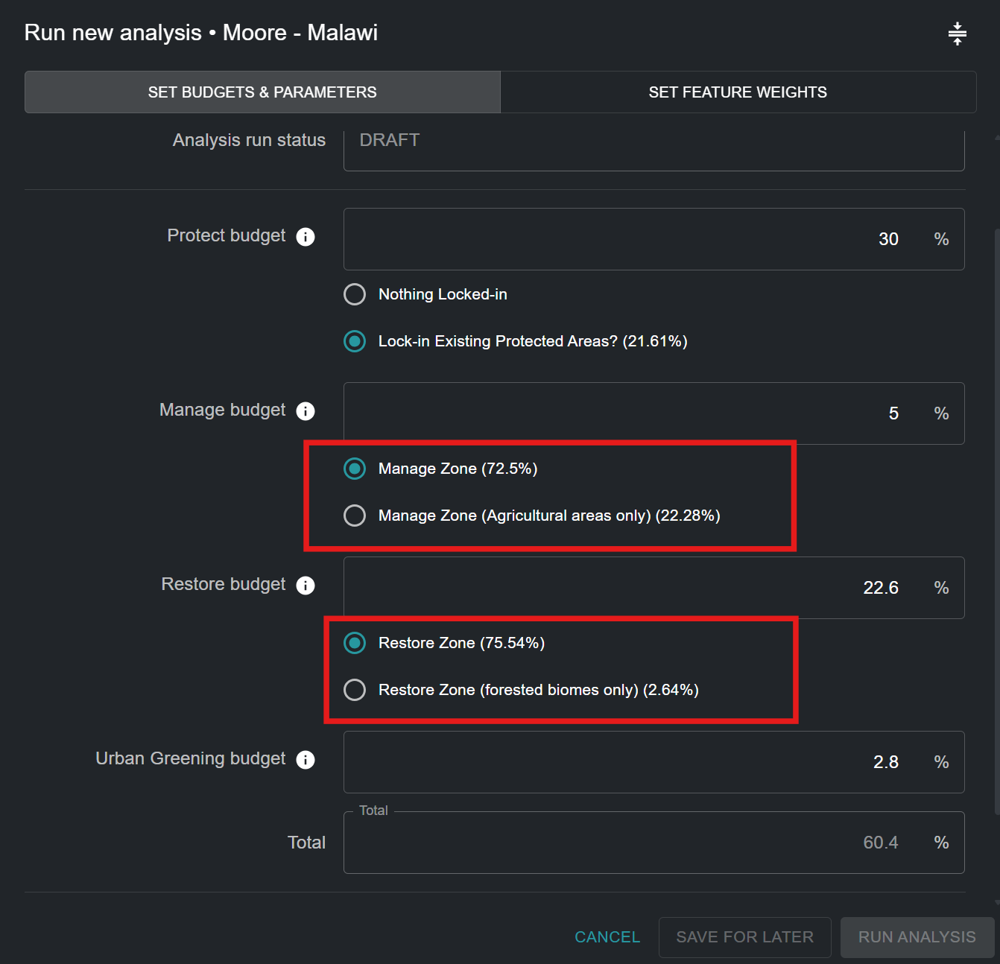
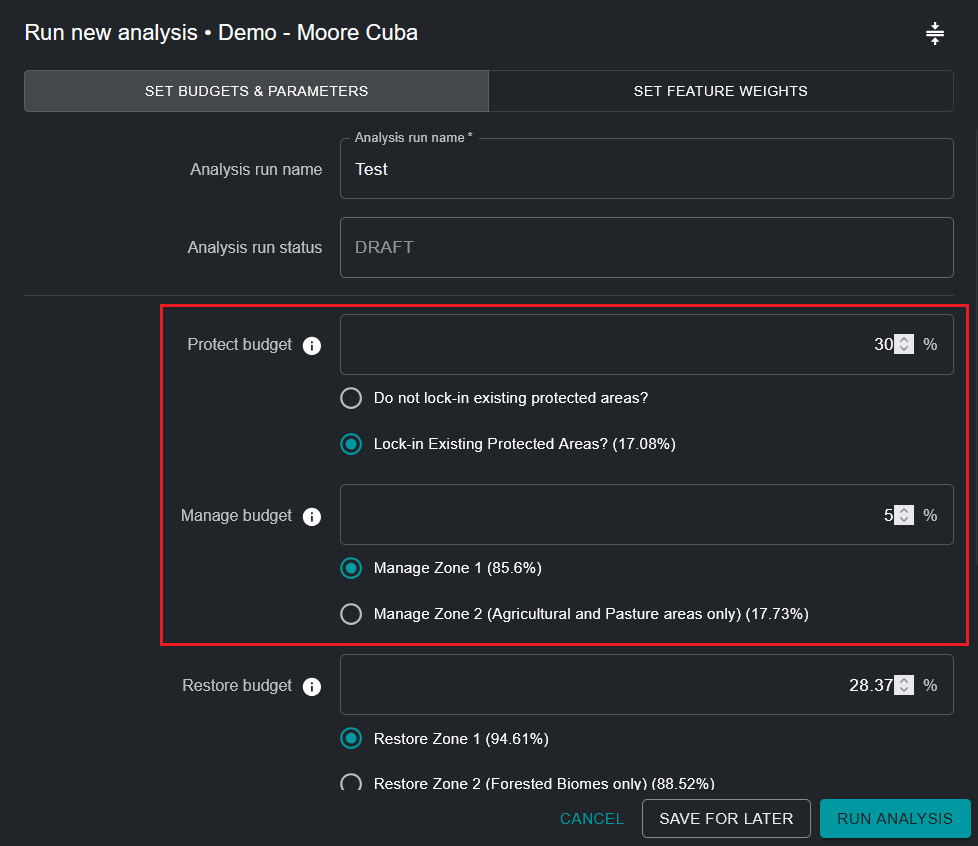
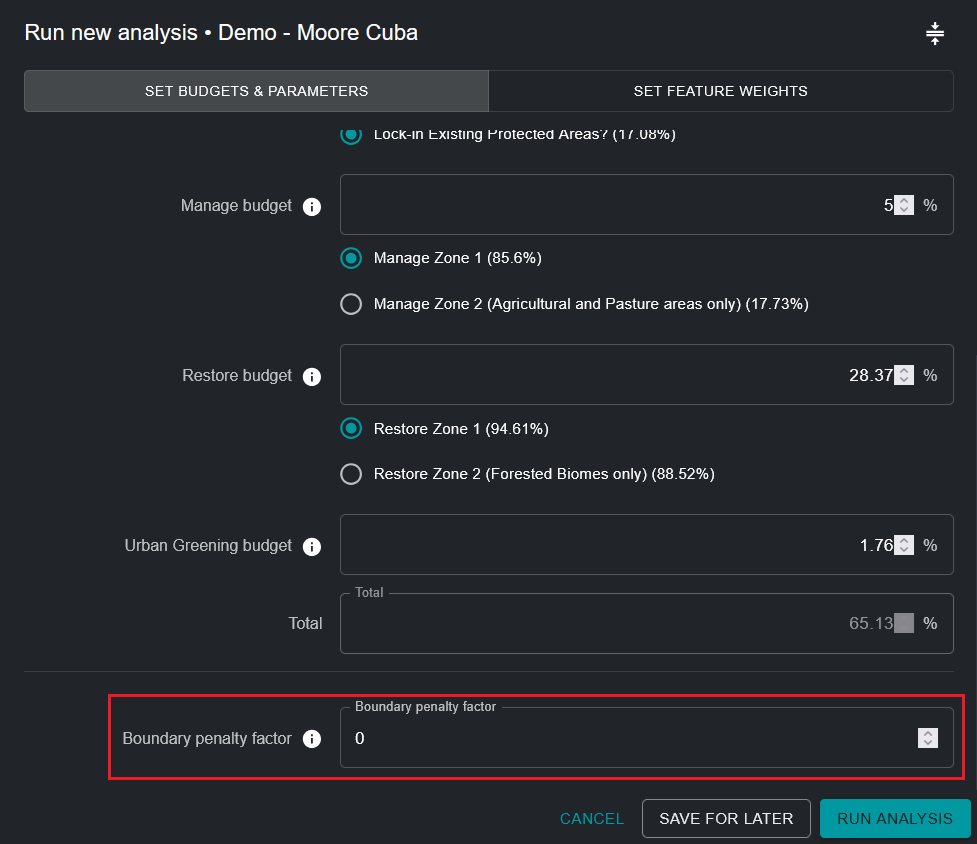
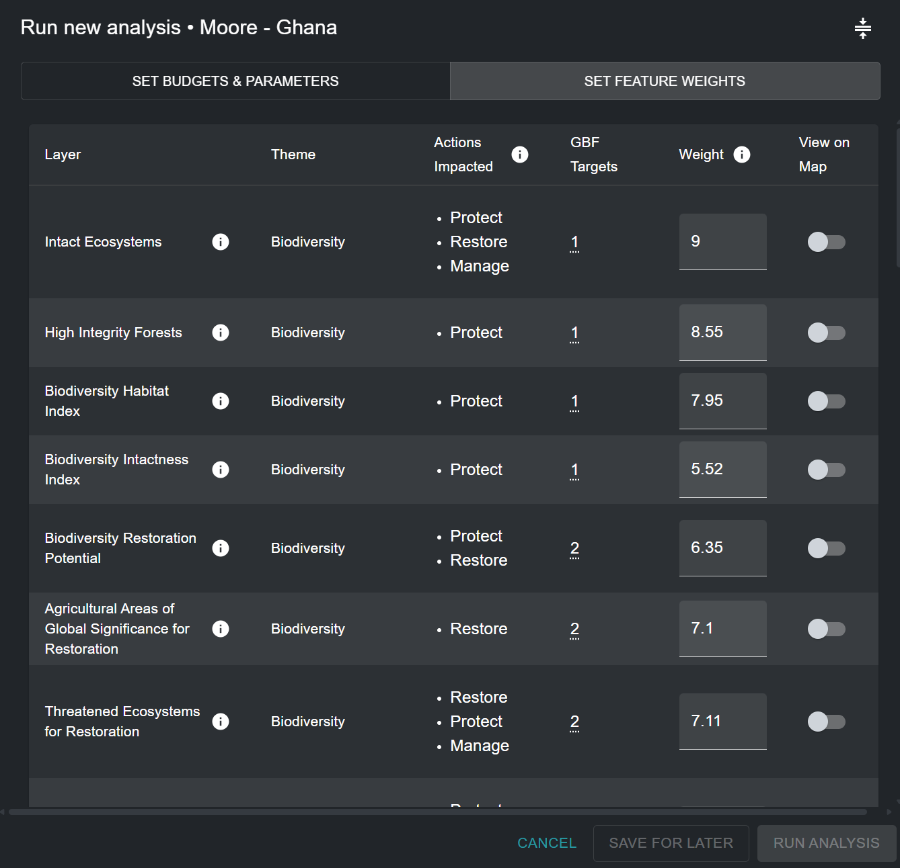
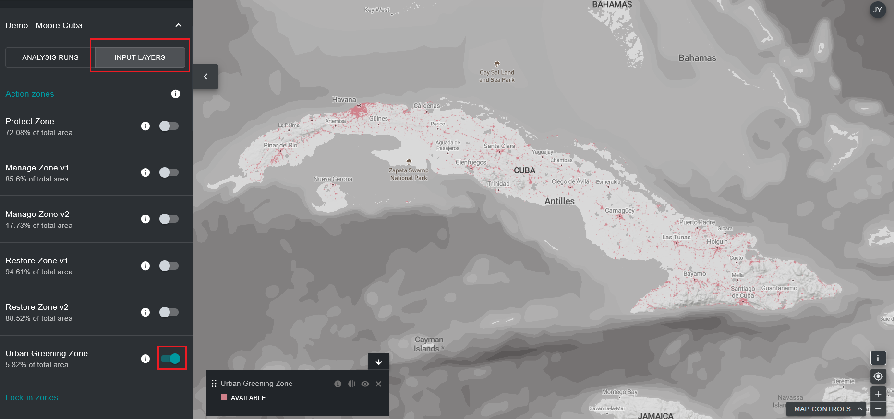
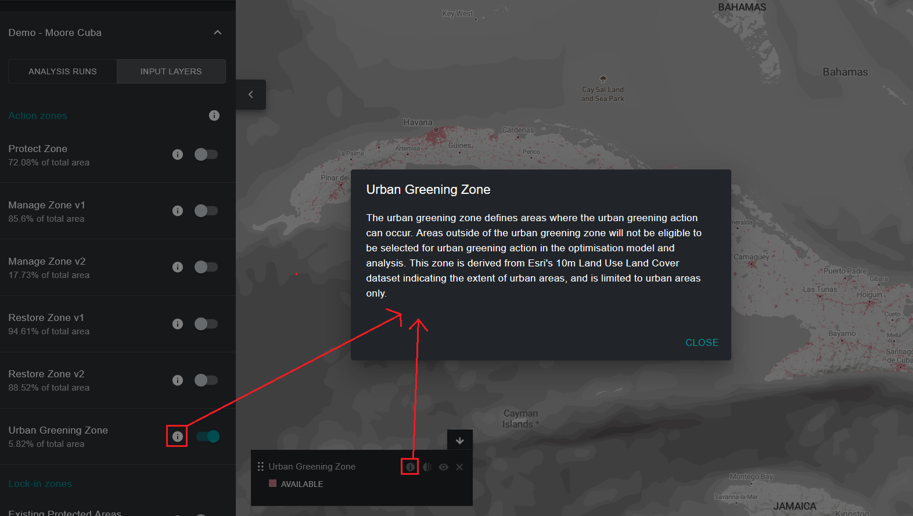

# Editing an ELSA analysis run

!!! info "Key Concepts"
    * [Action Zones](12_annex1.md#action-zones)
    * [Lock-in Features](12_annex1.md#lock-in-features)
    * [Area-based constraint](12_annex1.md#area-based-constraint)
    * [Boundary Penalty Factor (BPF)](12_annex1.md#boundary-penalty-factor-bpf)
    * [Planning feature](12_annex1.md#planning-feature)
    * [Planning units](12_annex1.md#planning-units)
    * [Decision support software](12_annex1.md#decision-support-software)
    * [Geographic Information System (GIS)](12_annex1.md#geographic-information-system-gis)
    * [Restrictions](12_annex1.md#restrictions)
    * [Representation](12_annex1.md#representation)
    * [Systematic Conservation Planning (SCP)](12_annex1.md#systematic-conservation-planning-scp)
    * [User interface](12_annex1.md#user-interface)
    * [Weights](12_annex1.md#weights)

## Naming ELSA analysis run

Upon clicking ‘NEW ANALYSIS RUN’ ([Figure 5](#fig-create-new-analysis)), you will be able to view and edit a tentative analysis. First, you must provide a new, unique name for your analysis run. While there are no restrictions on the name given to each run, we suggest that run names should include meaningful descriptions, ideally referencing the parameters used (e.g., include information like, BPF 10, or Protect 38%). 

## Selecting lock-in functions

You can ensure certain areas are included in your action map. Conceptually this is most easily understood as locking in existing planning areas to the protect action in a map – in essence replicating on the ground realities. This forces these areas to be selected within the protect action in the map, and these areas are forced to contribute to meeting the area constraint for protection. The national protected area coverage (%) is shown in parentheses. Tool configurations are not only limited to locking in existing protected areas to the protect action (for example, it might be desirable to lock-in existing restoration project areas to the restore action); however, by default tool configurations are currently only configured to allow lock-in of protected areas.    

!!! important
    Protected Areas are locked-in **BY DEFAULT**

Lock-in of Protected Areas ([Figure 6](#fig-lockin-options)):

* Select ‘Lock-in Existing Protected Areas’ if you want to force the analysis to include existing Protected Areas within the ‘Protection’ action in the solution. 
* Select ‘Lock-in nothing’ if you wish to independently assess the optimal location of existing and new Protected Areas in your country based on the ‘Protect’ areas selected in the resulting action map. 

<figure markdown>
{#fig-lockin-options}
<figcaption> Figure 6. Lock-in functionalities</figcaption>
</figure>

As seen in [Figure 6](#fig-lockin-options) for Cuba, existing Protected Areas cover 17.08% of the country. Therefore, the selection of ‘Lock-in Existing Protected Areas’ requires that at least 17.08% of the national territory be assigned under the ‘Protect’ area constraint. 

## Alternative Zones

Users cannot define zones themselves, but for some actions, there may be both a default zone and an alternative zone that can be selected. For example, some tools may have an option to consider "Agricultural areas only" for the manage action, or “Forested areas only” for the restore action, based on the individual needs and priorities of users and countries. 

<figure markdown>
{#fig-alt-zone-options}
<figcaption> Figure 7. Alternative zones for narrowing down nature-based activity areas</figcaption>
</figure>

## Setting area-based constraints for actions

This part of the tool allows you to set area-based constraints (targets) for protection, restoration, management and/or urban greening. Area constraints can also be understood as the percentage of land area that should be given to each action in the resulting action map. The default values in any given ELSA Tool are derived from terrestrial targets in the KMGBF, unless further customized for your country by the UNBL team based on your National Biodiversity Strategy and Action Plan (NBSAP) or other national policy documents. 

You can set any value greater than or equal to 0.001 for protection, restoration, management, and/or urban greening objectives. The sum of the value for all objectives may be less than or equal to 100% but should not exceed 100%. Additionally, the maximum value for any single area constraint cannot exceed the total area of that action zone. For example, if 80% of a country is covered by a protect zone, then the maximum value that can be assigned for the area-based constraint for protection cannot exceed 80%. If you enter a number that is too high, you will receive an error specifying the maximum amount that can be allocated.  

!!! note
    Note: The location and total area of each action zone defines where it is possible for each action to take place. It is determined based on ecosystem type and level of development in a country (e.g., protection cannot take place in areas with a high human industrial index).  

You should also consider that if you want to lock-in existing Protected Areas (the default), the overall protection area constraint must be equal to or greater than the land area covered by existing Protected Areas. For example, the land area covered by existing Protected Areas in Cuba is 17.08%. Therefore, the protect area constraint should be equal to or greater than 17.08%.

<figure markdown>
{#fig-setting-objectives}
<figcaption> Figure 8. Setting objectives</figcaption>
</figure>

## Specifying the boundary penalty factor

The boundary penalty factor is used to promote spatial cohesion when prioritizing land use zones. The boundary penalty can be 0 or higher. The higher the value, the more connected and contiguous the action zones will be on the map. This adjustment is based on the idea that, for real-world planning, a more connected zone is usually easier to manage and execute actions. 

Steps: 

1. To set the limit penalty, start with a small number, e.g. 10.
2. Increase the number iteratively, i.e., rerun the analysis repeatedly, by an order of magnitude (e.g., 10 -> 100-> 1000), reducing the rate of increase as you approach solutions that lead to your desired level of clustering. Each time you change the penalty, you will have to rerun the optimization until you arrive at a map that is sufficiently contiguous to meet your needs. 

!!! attention
    Increasing the boundary penalty factor from 0 will result in longer solve times; in some cases these can be much longer. 

<figure markdown>
{#fig-adjust-bpf}
<figcaption> Figure 9. Adjustment of the boundary penalty factor</figcaption>
</figure>

## Editing the weights of planning features

To edit planning feature weights, click on the ‘SET FEATURE WEIGHTS’ button near the top-right corner of the analysis run pop-up window. 

You should enter a weight for each planning feature in the input data list. We recommend a scale of 0 to 10 as follows, based on the priority level of each planning feature and your confidence in the accuracy of the dataset for your country: 

*  0 - not important / excluded from the analysis 
*  1.0 - low importance / lower importance than average 
*  5.0 - medium importance 
*  10 - utmost importance  

To allow users to make the most informed decision possible, the theme (biodiversity/climate change/human well-being), relevant actions, and proxy KMGBF policy target (or other relevant NBSAP/national policy target) are listed for each planning feature. You can evaluate the priority level of each planning feature and assign an informed weight by deciding on the relative importance of each of the planning features used to map KMGBF targets (or other relevant NBSAP/national policy targets otherwise defined by their country) in your country. For example, if KMGBF Target 1 is of especially high importance for your country, then planning features such as intact ecosystems, high integrity forests, biodiversity habitat index and biodiversity intactness index should be given greater weight (> 3). Alternatively, if you believe threatened ecosystems in your country are particularly degraded and should be considered for identifying priority areas for restoration for KMGBF Target 2, then you can give a higher weight to the ‘Threatened Ecosystems for Restoration’ planning feature which specifically maps these areas (see [Figure 10](#fig-edit-weights)). 

For a full list of input data, as well as which KMGBF targets they are used to map, please see [Annex 2](13_annex2.md).

<figure markdown>
{#fig-edit-weights}
<figcaption> Figure 10. Editing weights</figcaption>
</figure>

## View input layers

If you want to view planning features before setting weights, you will have to exit the pop-up window by clicking ‘SAVE FOR LATER’ in the bottom-right corner. You can then come back to your saved draft analysis run after viewing the desired planning features. 

To view planning features, click on the ‘INPUT LAYERS’ option next to the ‘ANALYSIS RUNS’ option in the left tool tab. You can then toggle specific input layers to view them on UNBL. 

<figure markdown>

<figcaption> Figure 11. Viewing action zones and planning features on UNBL</figcaption>
</figure>

By clicking on the ‘INPUT LAYERS’ tab, you can view each individual input planning feature layer included in the ELSA analysis; these inputs are specifically tailored to help identify priority areas for KMGBF implementation, as well as NBSAP/other national policy implementation, if specifically requested by your country. You can additionally view (optional) lock-in features (namely, existing protected areas) in your country. Finally, you can view the layer for each action zone that defines where it is possible for each action to take place in your country for the analysis.

Steps: 

* Click the toggle button for each action zone/lock-in zone/input planning feature layer you want to display.
* Click the toggle button again to remove the selected layer from the view.  
* You have the option to view additional information (description of the layer, original input layers, source) for currently toggled layers by clicking on the round ‘**i**’ icon either in the individual layer’s legend or next to the toggle button for each layer. 

<figure markdown>

<figcaption> Figure 12. Viewing metadata</figcaption>
</figure>
