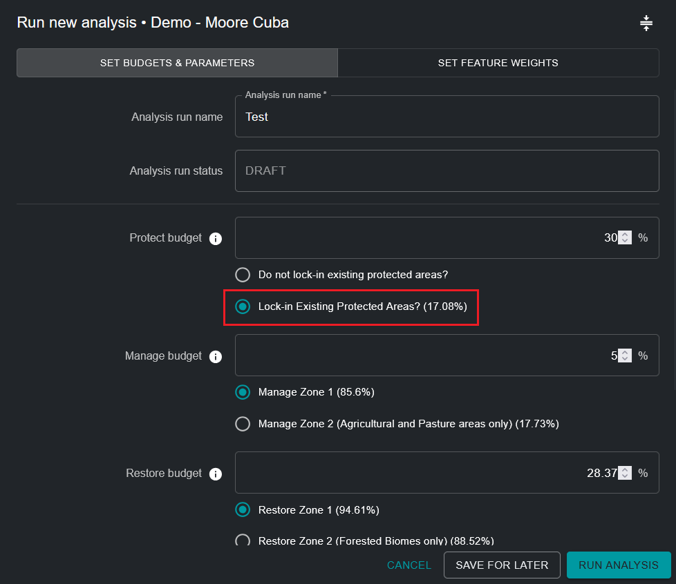

# Editar uma execução de análise ELSA

!!! info "Conceitos-Chave"
    * [Zonas de Ação](12_annex1.md#action-zones)
    * [Características de Bloqueio](12_annex1.md#lock-in-features)
    * [Restrição baseada em área](12_annex1.md#area-based-constraint)
    * [Fator de Penalidade de Fronteira (BPF)](12_annex1.md#boundary-penalty-factor-bpf)
    * [Característica de planejamento](12_annex1.md#planning-feature)
    * [Unidades de planejamento](12_annex1.md#planning-units)
    * [Software de apoio à decisão](12_annex1.md#decision-support-software)
    * [Sistema de Informação Geográfica (SIG)](12_annex1.md#geographic-information-system-gis)
    * [Restrições](12_annex1.md#restrictions)
    * [Representação](12_annex1.md#representation)
    * [Planejamento Sistemático de Conservação (SCP)](12_annex1.md#systematic-conservation-planning-scp)
    * [Interface do usuário](12_annex1.md#user-interface)
    * [Pesos](12_annex1.md#weights)

## Nomear a execução de análise ELSA

Ao clicar em 'NEW ANALYSIS RUN' (Figura 5), você poderá visualizar e editar uma análise provisória. Primeiro, você deve fornecer um novo nome único para sua execução de análise. Embora não haja restrições quanto ao nome dado a cada execução, sugerimos que os nomes das execuções incluam descrições significativas, idealmente fazendo referência aos parâmetros usados (por exemplo, incluir informações como BPF 10 ou Proteger 38%).

## Selecionar funções de bloqueio

Você pode garantir que certas áreas sejam incluídas em seu mapa de ação. Conceitualmente, isso é mais facilmente compreendido como bloquear áreas de planejamento existentes para a ação de proteção em um mapa - essencialmente replicando realidades no terreno. Isso força essas áreas a serem selecionadas dentro da ação de proteção no mapa, e essas áreas são forçadas a contribuir para atender à restrição de área para proteção. A cobertura nacional de área protegida (%) é mostrada entre parênteses. As configurações de ferramenta não se limitam apenas a bloquear áreas protegidas existentes para a ação de proteção (por exemplo, pode ser desejável bloquear áreas de projeto de restauração existentes para a ação de restauração); no entanto, por padrão, as configurações de ferramenta atualmente são configuradas apenas para permitir o bloqueio de áreas protegidas.

!!! important
    Áreas Protegidas são bloqueadas **POR PADRÃO**

Bloqueio de Áreas Protegidas ([Figura 1](#fig-lockin-options)):

* Selecione 'Lock-in Existing Protected Areas' se desejar forçar a análise a incluir Áreas Protegidas existentes dentro da ação de 'Proteção' na solução.
* Selecione 'Lock-in nothing' se desejar avaliar independentemente a localização ideal de Áreas Protegidas existentes e novas em seu país com base nas áreas de 'Proteção' selecionadas no mapa de ação resultante.

{#fig-lockin-options}

Como visto na [Figura 1](#fig-lockin-options) para Cuba, as Áreas Protegidas existentes cobrem 17,08% do país. Portanto, a seleção de 'Lock-in Existing Protected Areas' requer que pelo menos 17,08% do território nacional seja atribuído sob a restrição de área de 'Proteção'.

## Zonas Alternativas

Os usuários não podem definir zonas por si mesmos, mas para algumas ações, pode haver uma zona padrão e uma zona alternativa que pode ser selecionada. Por exemplo, algumas ferramentas podem ter uma opção para considerar "Apenas áreas agrícolas" para a ação de gestão, ou "Apenas áreas florestais" para a ação de restauração, com base nas necessidades e prioridades individuais de usuários e países.

{#fig-alt-zone-options}

## Definir restrições baseadas em área para ações

Esta parte da ferramenta permite que você defina restrições (metas) baseadas em área para proteção, restauração, gestão e/ou reverdecimento urbano. As restrições de área também podem ser compreendidas como a porcentagem de área de terra que deve ser atribuída a cada ação no mapa de ação resultante. Os valores padrão em qualquer Ferramenta ELSA são derivados de metas terrestres no KMGBF, a menos que sejam personalizados ainda mais para seu país pela equipe UNBL com base em sua Estratégia e Plano de Ação Nacional de Biodiversidade (NBSAP) ou outros documentos de política nacional.

Você pode definir qualquer valor maior ou igual a 0,001 para objetivos de proteção, restauração, gestão e/ou reverdecimento urbano. A soma do valor para todos os objetivos pode ser menor ou igual a 100%, mas não deve exceder 100%. Além disso, o valor máximo para qualquer restrição de área única não pode exceder a área total dessa zona de ação. Por exemplo, se 80% de um país for coberto por uma zona de proteção, então o valor máximo que pode ser atribuído para a restrição baseada em área para proteção não pode exceder 80%. Se você inserir um número muito alto, receberá um erro especificando o valor máximo que pode ser alocado.

!!! note
    Nota: A localização e a área total de cada zona de ação define onde é possível que cada ação ocorra. É determinado com base no tipo de ecossistema e nível de desenvolvimento em um país (por exemplo, a proteção não pode ocorrer em áreas com alto índice industrial humano).

Você também deve considerar que se deseja bloquear Áreas Protegidas existentes (o padrão), a restrição geral de área de proteção deve ser igual ou maior que a área de terra coberta por Áreas Protegidas existentes. Por exemplo, a área de terra coberta por Áreas Protegidas existentes em Cuba é de 17,08%. Portanto, a restrição de área de proteção deve ser igual ou maior que 17,08%.

{#fig-setting-objectives}

## Especificar o fator de penalidade de fronteira

O fator de penalidade de fronteira é usado para promover a coesão espacial ao priorizar zonas de uso da terra. A penalidade de fronteira pode ser 0 ou maior. Quanto maior o valor, mais conectadas e contíguas serão as zonas de ação no mapa. Este ajuste é baseado na ideia de que, para o planejamento do mundo real, uma zona mais conectada geralmente é mais fácil de gerenciar e executar ações.

Passos:

1. Para definir a penalidade de limite, comece com um número pequeno, por exemplo, 10.
2. Aumente o número iterativamente, ou seja, execute novamente a análise repetidamente, por ordem de magnitude (por exemplo, 10 -> 100-> 1000), reduzindo a taxa de aumento conforme você se aproxima de soluções que levam ao seu nível desejado de agrupamento. Cada vez que você alterar a penalidade, terá que executar novamente a otimização até chegar a um mapa que seja suficientemente contíguo para atender às suas necessidades.

!!! attention
    Aumentar o fator de penalidade de fronteira de 0 resultará em tempos de resolução mais longos; em alguns casos, estes podem ser muito mais longos.

{#fig-adjust-bpf}

## Editar os pesos das características de planejamento

Para editar os pesos das características de planejamento, clique no botão 'SET FEATURE WEIGHTS' próximo ao canto superior direito da janela pop-up de execução de análise.

Você deve inserir um peso para cada característica de planejamento na lista de dados de entrada. Recomendamos uma escala de 0 a 10 da seguinte forma, com base no nível de prioridade de cada característica de planejamento e sua confiança na precisão do conjunto de dados para seu país:

* 0 - não importante / excluído da análise
* 1,0 - baixa importância / importância menor que a média
* 5,0 - importância média
* 10 - máxima importância

Para permitir que os usuários tomem a decisão mais informada possível, o tema (biodiversidade/mudança climática/bem-estar humano), ações relevantes e meta política proxy do KMGBF (ou outra meta política nacional/NBSAP relevante) são listados para cada característica de planejamento. Você pode avaliar o nível de prioridade de cada característica de planejamento e atribuir um peso informado decidindo sobre a importância relativa de cada uma das características de planejamento usadas para mapear metas do KMGBF (ou outras metas políticas nacionais/NBSAP relevantes definidas de outra forma pelo seu país) em seu país. Por exemplo, se a Meta 1 do KMGBF for de especial importância para seu país, então características de planejamento como ecossistemas intactos, florestas de alta integridade, índice de habitat de biodiversidade e índice de integridade de biodiversidade devem receber maior peso (> 3). Alternativamente, se você acredita que ecossistemas ameaçados em seu país estão particularmente degradados e devem ser considerados para identificar áreas prioritárias para restauração para a Meta 2 do KMGBF, então você pode dar um peso maior à característica de planejamento 'Ecossistemas Ameaçados para Restauração' que mapeia especificamente essas áreas (consulte [Figura 5](#fig-edit-weights)).

Para uma lista completa de dados de entrada, bem como quais metas do KMGBF são usadas para mapear, consulte o [Anexo 2](13_annex2.md).

{#fig-edit-weights}

## Visualizar camadas de entrada

Se você deseja visualizar características de planejamento antes de definir pesos, terá que sair da janela pop-up clicando em 'SAVE FOR LATER' no canto inferior direito. Você pode então retornar à sua execução de análise de rascunho salva depois de visualizar as características de planejamento desejadas.

Para visualizar características de planejamento, clique na opção 'INPUT LAYERS' ao lado da opção 'ANALYSIS RUNS' na aba de ferramentas à esquerda. Você pode então alternar camadas de entrada específicas para visualizá-las na UNBL.

Ao clicar na aba 'INPUT LAYERS', você pode visualizar cada camada individual de característica de planejamento de entrada incluída na análise ELSA; essas entradas são especificamente adaptadas para ajudar a identificar áreas prioritárias para a implementação do KMGBF, bem como implementação de NBSAP/outra política nacional, se especificamente solicitado pelo seu país. Você pode adicionalmente visualizar características de bloqueio (opcionais) (ou seja, áreas protegidas existentes) em seu país. Finalmente, você pode visualizar a camada para cada zona de ação que define onde é possível que cada ação ocorra em seu país para a análise.

Passos:

* Clique no botão de alternância para cada zona de ação/zona de bloqueio/camada de característica de planejamento de entrada que deseja exibir.
* Clique no botão de alternância novamente para remover a camada selecionada da visualização.
* Você tem a opção de visualizar informações adicionais (descrição da camada, camadas de entrada originais, fonte) para camadas atualmente alternadas clicando no ícone redondo '**i**' na legenda da camada individual ou ao lado do botão de alternância para cada camada.

