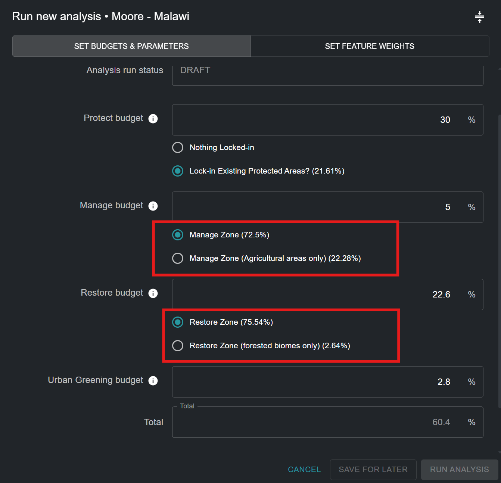
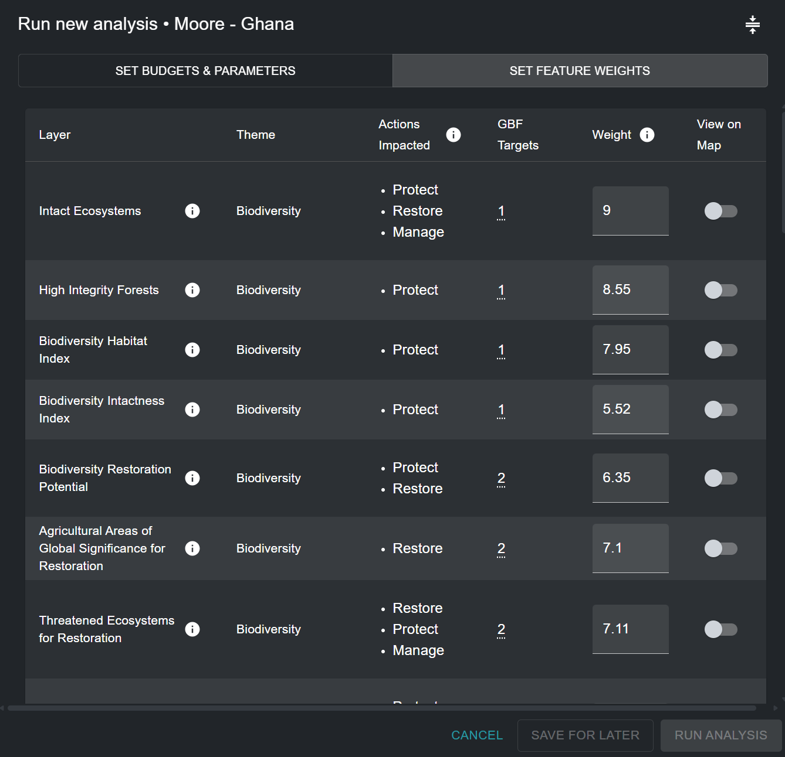

# Редактирование запуска анализа ELSA

!!! info "Ключевые концепции"
    * [Зоны действий](12_annex1.md#action-zones)
    * [Характеристики закрепления](12_annex1.md#lock-in-features)
    * [Ограничение на основе площади](12_annex1.md#area-based-constraint)
    * [Фактор штрафа за границу (BPF)](12_annex1.md#boundary-penalty-factor-bpf)
    * [Характеристика планирования](12_annex1.md#planning-feature)
    * [Единицы планирования](12_annex1.md#planning-units)
    * [Программное обеспечение для поддержки принятия решений](12_annex1.md#decision-support-software)
    * [Географическая информационная система (ГИС)](12_annex1.md#geographic-information-system-gis)
    * [Ограничения](12_annex1.md#restrictions)
    * [Представительство](12_annex1.md#representation)
    * [Систематическое планирование сохранения (SCP)](12_annex1.md#systematic-conservation-planning-scp)
    * [Пользовательский интерфейс](12_annex1.md#user-interface)
    * [Веса](12_annex1.md#weights)

## Именование запуска анализа ELSA

При нажатии на 'NEW ANALYSIS RUN' (Рисунок 5) вы сможете просмотреть и отредактировать предварительный анализ. Сначала вы должны предоставить новое уникальное имя для вашего запуска анализа. Хотя нет ограничений на имя, присваиваемое каждому запуску, мы предлагаем, чтобы имена запусков включали значимые описания, в идеале ссылающиеся на используемые параметры (например, включать информацию вроде BPF 10 или Охрана 38%).

## Выбор функций закрепления

Вы можете обеспечить включение определенных областей в вашу карту действий. Концептуально это проще всего понять как закрепление существующих областей планирования к действию охраны на карте - по сути, воспроизведение реальности на местности. Это заставляет выбирать эти области в рамках действия охраны на карте, и эти области вынуждены вносить вклад в выполнение ограничения по площади для охраны. Национальное покрытие охраняемой территории (%) показано в скобках. Конфигурации инструмента не ограничиваются только закреплением существующих охраняемых территорий к действию охраны (например, может быть желательно закрепить существующие области проектов восстановления к действию восстановления); однако по умолчанию конфигурации инструмента в настоящее время настроены только для разрешения закрепления охраняемых территорий.

!!! important
    Охраняемые территории закреплены **ПО УМОЛЧАНИЮ**

Закрепление охраняемых территорий ([Рисунок 1](#fig-lockin-options)):

* Выберите 'Lock-in Existing Protected Areas', если вы хотите заставить анализ включить существующие охраняемые территории в действие 'Охрана' в решении.
* Выберите 'Lock-in nothing', если вы хотите независимо оценить оптимальное расположение существующих и новых охраняемых территорий в вашей стране на основе областей 'Охрана', выбранных на результирующей карте действий.

{#fig-lockin-options}

Как видно на [Рисунке 1](#fig-lockin-options) для Кубы, существующие охраняемые территории покрывают 17,08% страны. Следовательно, выбор 'Lock-in Existing Protected Areas' требует, чтобы не менее 17,08% национальной территории было выделено под ограничение области 'Охрана'.

## Альтернативные зоны

Пользователи не могут определять зоны самостоятельно, но для некоторых действий может быть как зона по умолчанию, так и альтернативная зона, которую можно выбрать. Например, некоторые инструменты могут иметь опцию рассматривать "Только сельскохозяйственные области" для действия управления или "Только лесные области" для действия восстановления, в зависимости от индивидуальных потребностей и приоритетов пользователей и стран.

{#fig-alt-zone-options}

## Установка ограничений на основе площади для действий

Эта часть инструмента позволяет вам установить ограничения (цели) на основе площади для охраны, восстановления, управления и/или озеленения городов. Ограничения по площади также можно понимать как процент площади земли, который должен быть предоставлен каждому действию на результирующей карте действий. Значения по умолчанию в любом данном Инструменте ELSA получены из наземных целей в KMGBF, если они не были дополнительно настроены для вашей страны командой UNBL на основе вашей Национальной стратегии и плана действий по сохранению биоразнообразия (NBSAP) или других национальных политических документов.

Вы можете установить любое значение больше или равное 0,001 для целей охраны, восстановления, управления и/или озеленения городов. Сумма значения для всех целей может быть меньше или равна 100%, но не должна превышать 100%. Кроме того, максимальное значение для любого отдельного ограничения по площади не может превышать общую площадь этой зоны действий. Например, если 80% страны покрыто зоной охраны, то максимальное значение, которое может быть назначено для ограничения на основе площади для охраны, не может превышать 80%. Если вы введете слишком большое число, вы получите ошибку с указанием максимальной суммы, которая может быть выделена.

!!! note
    Примечание: Расположение и общая площадь каждой зоны действий определяет, где возможно для каждого действия. Это определяется на основе типа экосистемы и уровня развития в стране (например, охрана не может происходить в областях с высоким индексом промышленной активности человека).

Вы также должны учитывать, что если вы хотите закрепить существующие охраняемые территории (по умолчанию), общее ограничение области охраны должно быть равно или больше площади земли, покрытой существующими охраняемыми территориями. Например, площадь земли, покрытая существующими охраняемыми территориями на Кубе, составляет 17,08%. Следовательно, ограничение области охраны должно быть равно или больше 17,08%.

{#fig-setting-objectives}

## Указание фактора штрафа за границу

Фактор штрафа за границу используется для содействия пространственной связности при приоритизации зон землепользования. Штраф за границу может быть 0 или больше. Чем выше значение, тем более связанными и смежными будут зоны действий на карте. Эта корректировка основана на идее, что для реального планирования более связанная зона обычно легче управляется и выполняет действия.

Шаги:

1. Чтобы установить штраф за границу, начните с небольшого числа, например, 10.
2. Увеличивайте число итеративно, то есть повторно запускайте анализ по порядку величины (например, 10 -> 100-> 1000), уменьшая скорость увеличения по мере приближения к решениям, которые приводят к желаемому уровню кластеризации. Каждый раз, когда вы изменяете штраф, вам придется повторно запускать оптимизацию, пока вы не придете к карте, которая достаточно смежна для удовлетворения ваших потребностей.

!!! attention
    Увеличение фактора штрафа за границу от 0 приведет к увеличению времени решения; в некоторых случаях они могут быть намного длиннее.

{#fig-adjust-bpf}

## Редактирование весов характеристик планирования

Чтобы отредактировать веса характеристик планирования, нажмите кнопку 'SET FEATURE WEIGHTS' в правом верхнем углу всплывающего окна запуска анализа.

Вы должны ввести вес для каждой характеристики планирования в списке входных данных. Мы рекомендуем шкалу от 0 до 10 следующим образом, основываясь на уровне приоритета каждой характеристики планирования и вашей уверенности в точности набора данных для вашей страны:

* 0 - не важно / исключено из анализа
* 1,0 - низкая важность / важность ниже средней
* 5,0 - средняя важность
* 10 - максимальная важность

Чтобы позволить пользователям принять наиболее обоснованное решение, тема (биоразнообразие/изменение климата/благополучие человека), соответствующие действия и целевая политическая цель KMGBF (или другая соответствующая национальная политическая цель/цель NBSAP) перечислены для каждой характеристики планирования. Вы можете оценить уровень приоритета каждой характеристики планирования и назначить обоснованный вес, решив относительную важность каждой из характеристик планирования, используемых для картирования целей KMGBF (или других соответствующих национальных политических целей/целей NBSAP, определенных иным образом вашей страной) в вашей стране. Например, если Цель 1 KMGBF имеет особенно высокую важность для вашей страны, то характеристики планирования, такие как нетронутые экосистемы, леса высокой целостности, индекс среды обитания биоразнообразия и индекс целостности биоразнообразия, должны получить больший вес (> 3). В качестве альтернативы, если вы считаете, что находящиеся под угрозой экосистемы в вашей стране особенно деградированы и должны рассматриваться для определения приоритетных областей для восстановления для Цели 2 KMGBF, то вы можете дать более высокий вес характеристике планирования 'Находящиеся под угрозой экосистемы для восстановления', которая специально картирует эти области (см. [Рисунок 5](#fig-edit-weights)).

Для полного списка входных данных, а также того, какие цели KMGBF они используются для картирования, см. [Приложение 2](13_annex2.md).

{#fig-edit-weights}

## Просмотр входных слоев

Если вы хотите просмотреть характеристики планирования перед установкой весов, вам нужно будет выйти из всплывающего окна, нажав 'SAVE FOR LATER' в правом нижнем углу. Затем вы можете вернуться к сохраненному черновому запуску анализа после просмотра желаемых характеристик планирования.

Чтобы просмотреть характеристики планирования, нажмите на опцию 'INPUT LAYERS' рядом с опцией 'ANALYSIS RUNS' на левой вкладке инструмента. Затем вы можете переключить конкретные входные слои для их просмотра на UNBL.

Нажав на вкладку 'INPUT LAYERS', вы можете просмотреть каждый отдельный слой входных характеристик планирования, включенный в анализ ELSA; эти входные данные специально адаптированы для помощи в определении приоритетных областей для реализации KMGBF, а также реализации NBSAP/другой национальной политики, если это специально запрошено вашей страной. Вы также можете просмотреть (необязательные) характеристики закрепления (а именно, существующие охраняемые территории) в вашей стране. Наконец, вы можете просмотреть слой для каждой зоны действий, который определяет, где возможно для каждого действия в вашей стране для анализа.

Шаги:

* Нажмите кнопку переключения для каждой зоны действий/зоны закрепления/слоя входных характеристик планирования, который вы хотите отобразить.
* Нажмите кнопку переключения снова, чтобы удалить выбранный слой из представления.
* У вас есть возможность просмотреть дополнительную информацию (описание слоя, исходные входные слои, источник) для текущих переключенных слоев, нажав на круглый значок '**i**' в легенде отдельного слоя или рядом с кнопкой переключения для каждого слоя.

