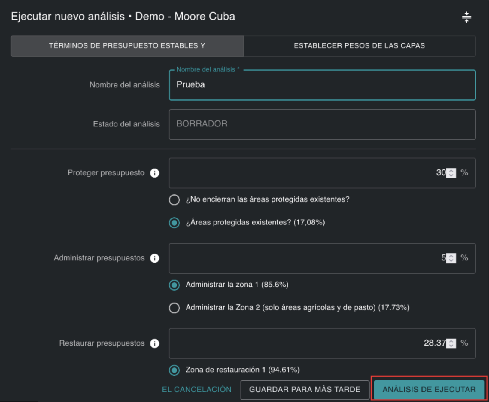
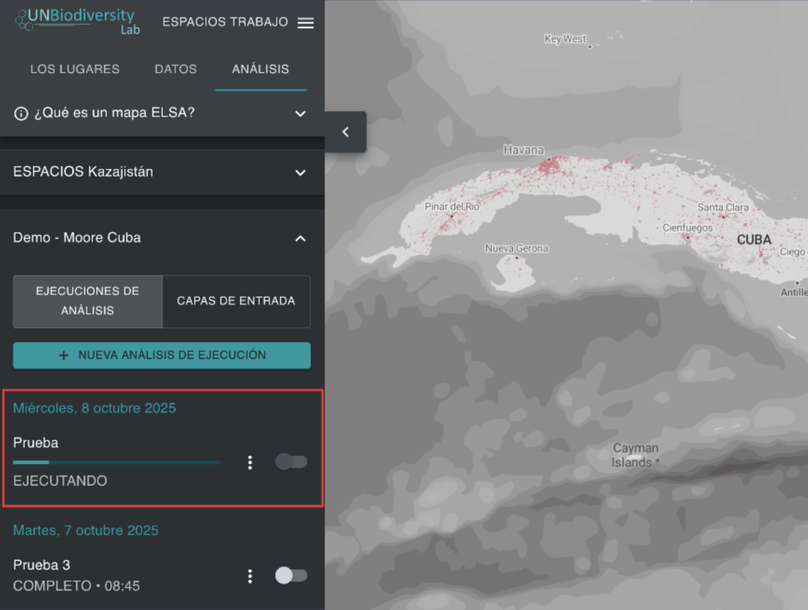

# Ejecución de la optimización  

Para crear un mapa de acción que muestre las áreas prioritarias para la implementación de las Metas 1-12 del MMB-KM, la optimización ejecutada por la herramienta sigue tres reglas codificadas:   

* No debe exceder las restricciones basadas en el área seleccionada;  
* Debe incluir las áreas de bloqueo seleccionadas; y  
* Debe incluir las áreas que mejor representen las características de planificación en función de su distribución espacial y ponderación.  

Una vez que haya nombrado su ejecución de análisis, establecido las restricciones basadas en el área, las funcionalidades de bloqueo, un factor de penalización de límites y editado las ponderaciones de las características de planificación, la ejecución del análisis estará lista para ser ejecutada. Esto se puede hacer haciendo clic en el botón azul «EJECUTAR ANÁLISIS» en la esquina inferior derecha de la ventana emergente de ejecución del análisis. Tenga en cuenta que este botón solo estará disponible para hacer clic y ejecutar una vez que se hayan rellenado todos los parámetros relevantes.   

<figure markdown>

<figcaption> Figura 13. Ejecutar análisis</figcaption>
</figure>

El análisis puede tardar entre uno y cinco minutos en ejecutarse. Sin embargo, si el país es grande, se utilizan muchas características de planificación o se aplica un factor de penalización de límites alto, puede tardar mucho más tiempo. Verá una barra de progreso que documenta el estado del análisis. No recomendamos ejecutar un segundo análisis ELSA antes de que haya finalizado el primero. Una vez que la barra de progreso haya alcanzado el 100 % y se haya ejecutado el análisis, podrá ver el resultado de su análisis como la entrada más reciente en la pestaña izquierda, en «EJECUCIONES DE ANÁLISIS».   

## Próximos Pasos

En los siguientes capítulos se detalla cómo puede ver, evaluar y analizar los resultados de su análisis ELSA. Si desea cambiar los parámetros de su análisis y ejecutar una nueva ejecución después de evaluar los resultados, puede duplicar una ejecución anterior, editarla y crear una nueva versión. 

<figure markdown>

<figcaption> Figura 14. Análisis ELSA ejecutado en tiempo real </figcaption>
</figure>
