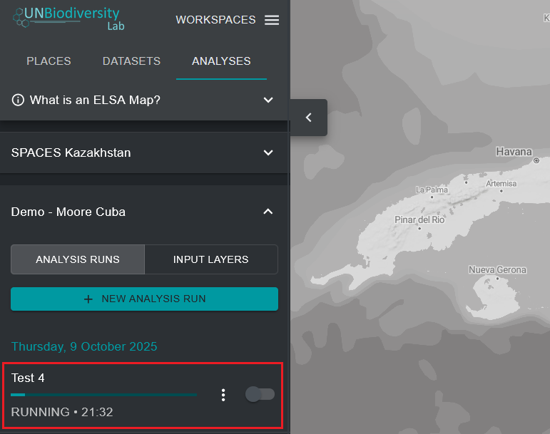

# Ejecutar la optimización

Para crear un mapa de acción ELSA que muestre áreas prioritarias para la implementación de los Objetivos 1-12 del KMGBF, la optimización ejecutada por la herramienta sigue tres reglas codificadas:

* No debe exceder las restricciones basadas en área seleccionadas;
* Debe incluir áreas de bloqueo seleccionadas; y
* Debe incluir áreas que mejor representen las características de planificación según su distribución espacial y ponderación.

Una vez que haya nombrado su ejecución de análisis, establecido restricciones basadas en área, funcionalidades de bloqueo, un factor de penalización de límites y editado los pesos de las características de planificación, la ejecución de análisis está lista para ser ejecutada. Esto se puede hacer haciendo clic en el botón azul 'RUN ANALYSIS' en la esquina inferior derecha de la ventana emergente de ejecución de análisis. Tenga en cuenta que este botón solo estará disponible para hacer clic y ejecutar una vez que se hayan completado todos los parámetros relevantes.

El análisis puede tardar entre uno y cinco minutos en ejecutarse. Sin embargo, si el país es grande, se utilizan muchas características de planificación o se aplica un factor de penalización de límites alto, puede tardar mucho más. Verá una barra de progreso que documenta el estado del análisis. Aconsejamos no ejecutar un segundo análisis ELSA antes de que se haya completado el primer análisis. Una vez que la barra de progreso haya alcanzado el 100% y se haya ejecutado el análisis, puede ver el resultado de su análisis como la entrada más reciente en la pestaña izquierda bajo 'ANALYSIS RUNS'.

## Próximos Pasos

Los siguientes capítulos detallan cómo puede ver, evaluar y analizar los resultados de su análisis ELSA. Si desea cambiar los parámetros de su análisis y ejecutar una nueva ejecución después de evaluar los resultados, puede duplicar una ejecución anterior, editarla y crear una nueva versión.

