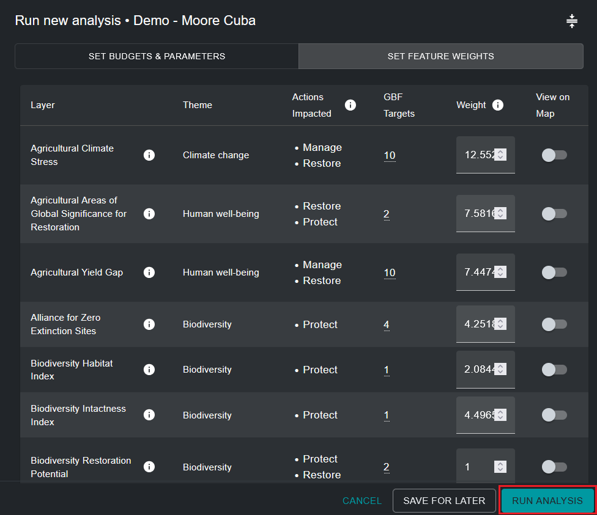
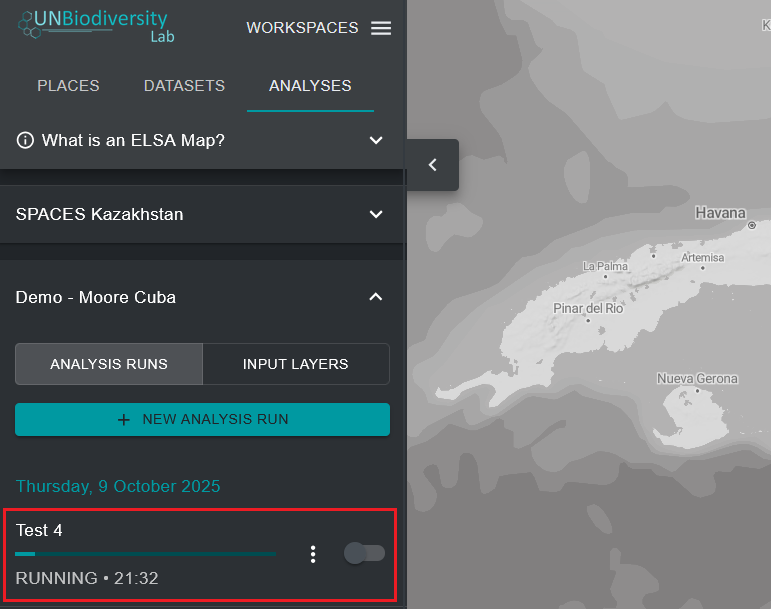

# Exécuter l'optimisation

Pour créer une carte d'action ELSA montrant les zones prioritaires pour la mise en œuvre des Objectifs 1-12 du KMGBF, l'optimisation exécutée par l'outil suit trois règles codées en dur :

* Elle ne doit pas dépasser les contraintes basées sur la zone sélectionnées ;
* Elle doit inclure les zones de verrouillage sélectionnées ; et
* Elle doit inclure les zones qui représentent le mieux les caractéristiques de planification en fonction de leur distribution spatiale et de leur pondération.

Une fois que vous avez nommé votre exécution d'analyse, défini les contraintes basées sur la zone, les fonctionnalités de verrouillage, un facteur de pénalité de frontière et modifié les poids des caractéristiques de planification, l'exécution d'analyse est prête à être exécutée. Cela peut être fait en cliquant sur le bouton bleu 'RUN ANALYSIS' dans le coin inférieur droit de la fenêtre contextuelle d'exécution d'analyse. Notez que ce bouton ne deviendra disponible pour cliquer et exécuter qu'une fois que tous les paramètres pertinents auront été remplis.

L'analyse peut prendre entre une et cinq minutes pour s'exécuter. Cependant, si le pays est grand, de nombreuses caractéristiques de planification sont utilisées ou un facteur de pénalité de frontière élevé est appliqué, cela peut prendre beaucoup plus de temps. Vous verrez une barre de progression documentant l'état de l'analyse. Nous déconseillons d'exécuter une deuxième analyse ELSA avant que la première analyse ne soit terminée. Une fois que la barre de progression a atteint 100% et que l'analyse a été exécutée, vous pouvez visualiser le résultat de votre analyse comme l'entrée la plus récente dans l'onglet de gauche sous 'ANALYSIS RUNS'.

## Prochaines Étapes

Les chapitres suivants détaillent comment vous pouvez visualiser, évaluer et analyser les résultats de votre analyse ELSA. Si vous souhaitez modifier les paramètres de votre analyse et exécuter une nouvelle exécution après avoir évalué les résultats, vous pouvez dupliquer une exécution précédente, la modifier et créer une nouvelle version.

