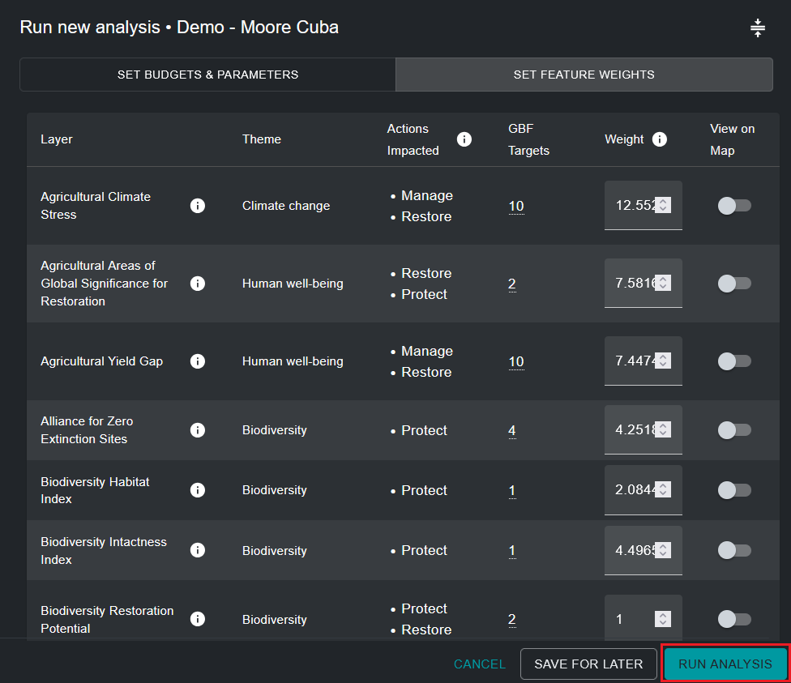

# Запуск оптимизации

Чтобы создать карту действий ELSA, показывающую приоритетные области для реализации Целей 1-12 KMGBF, оптимизация, выполняемая инструментом, следует трем жестко закодированным правилам:

* Она не должна превышать выбранные ограничения на основе площади;
* Она должна включать выбранные области закрепления; и
* Она должна включать области, которые лучше всего представляют характеристики планирования на основе их пространственного распределения и взвешивания.

После того как вы назвали свой запуск анализа, установили ограничения на основе площади, функции закрепления, фактор штрафа за границу и отредактировали веса характеристик планирования, запуск анализа готов к выполнению. Это можно сделать, нажав синюю кнопку 'RUN ANALYSIS' в правом нижнем углу всплывающего окна запуска анализа. Обратите внимание, что эта кнопка станет доступной для нажатия и выполнения только после заполнения всех соответствующих параметров.

Выполнение анализа может занять от одной до пяти минут. Однако, если страна большая, используется много характеристик планирования или применяется высокий фактор штрафа за границу, это может занять гораздо больше времени. Вы увидите индикатор выполнения, документирующий статус анализа. Мы не рекомендуем запускать второй анализ ELSA до завершения первого анализа. Как только индикатор выполнения достигнет 100% и анализ будет выполнен, вы можете просмотреть результат вашего анализа как самую последнюю запись на левой вкладке в 'ANALYSIS RUNS'.

## Следующие шаги

Следующие главы подробно описывают, как вы можете просматривать, оценивать и анализировать результаты вашего анализа ELSA. Если вы хотите изменить параметры вашего анализа и выполнить новый запуск после оценки результатов, вы можете дублировать предыдущий запуск, отредактировать его и создать новую версию.

