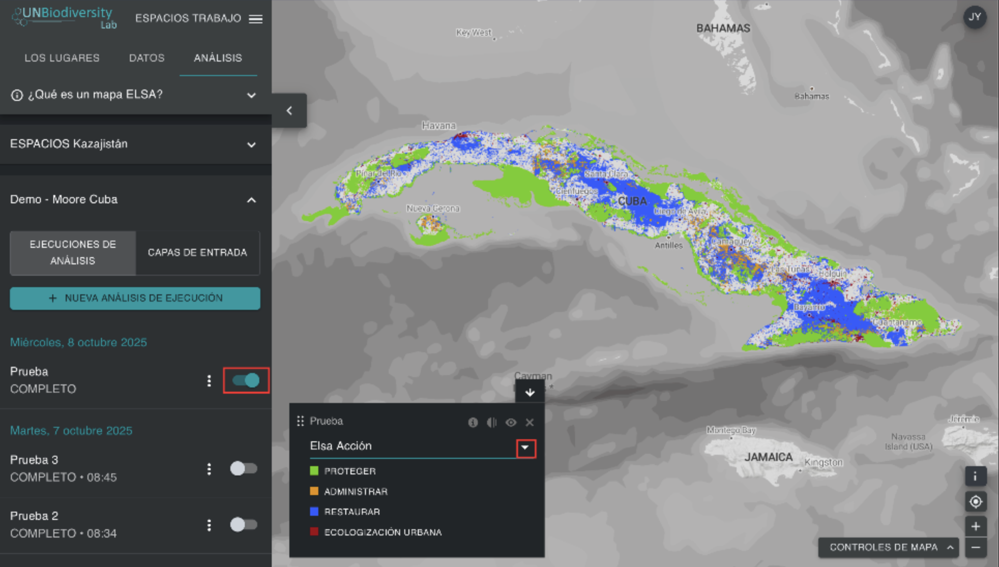
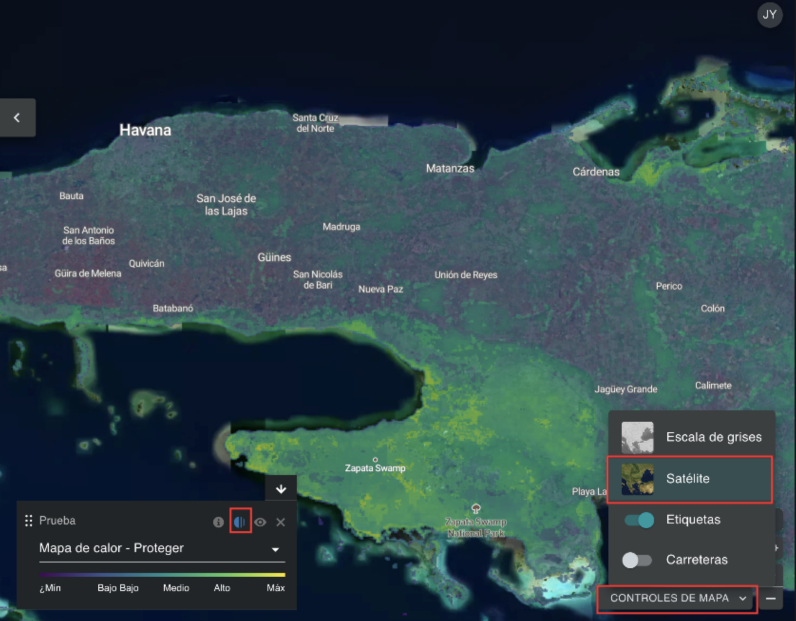

# Visualización de mapas de calor  

Al ejecutar un análisis ELSA, podrá ver los resultados haciendo clic en los tres puntos verticales situados junto a la entrada del análisis en la pestaña izquierda y haciendo clic en el botón «Ver». En el menú desplegable de la leyenda que aparece en el mapa, puede elegir entre ver el mapa de acciones final o las capas del mapa de calor. Le sugerimos que vea primero los mapas de calor.   

<figure markdown>
{#fig-viewing-hm}
<figcaption> Figura 15. Ver capas de mapa de calor</figcaption>
</figure>

Los mapas de calor identifican ubicaciones importantes para alcanzar las metas 1-12 del MMB-KM u otros objetivos políticos especificados por su país. Son la suma normalizada de los valores de las características de planificación en cada unidad de planificación, teniendo en cuenta las ponderaciones que los usuarios otorgan a cada característica de planificación. Las áreas importantes (donde se producen más características de planificación, ajustadas por ponderación) se muestran en una gama de colores que va del verde al amarillo, siendo las de color amarillo brillante las más importantes. Los mapas de calor pueden utilizarse para identificar las áreas en las que la contribución global de las características de planificación a las Metas 1-12 del MMB-KM es mayor.  

Al evaluar los mapas de calor, los expertos en datos pueden ver los datos agregados de las características de planificación ponderadas por los usuarios para determinar si los patrones coinciden con sus expectativas y su conocimiento personal de la región. Para ayudar en este proceso, los usuarios pueden alternar entre los mapas de calor y las imágenes satelitales, los mapas de carreteras y los mapas de características de planificación subyacentes, lo que ayuda a orientar los mapas de calor en el paisaje e identificar qué características de planificación contribuyen específicamente a las áreas de gran importancia para las Metas del MMB-KM.  

!!! important
    Para alternar entre las imágenes satelitales y las carreteras, los usuarios deben hacer clic en el botón «CONTROLES DE MAPA» en la parte inferior derecha de la pantalla. A continuación, los usuarios pueden hacer clic en el icono del ojo en el cuadro de leyenda para ocultar el mapa de calor y ver las imágenes satelitales, o en el botón de opacidad a la izquierda del icono del ojo para reducir la opacidad del mapa de calor y ver las imágenes satelitales subyacentes y el mapa de calor al mismo tiempo.  

<figure markdown>
{#fig-eval-hm}
<figcaption> Figura 16. Evaluar mapas de calor</figcaption>
</figure>
