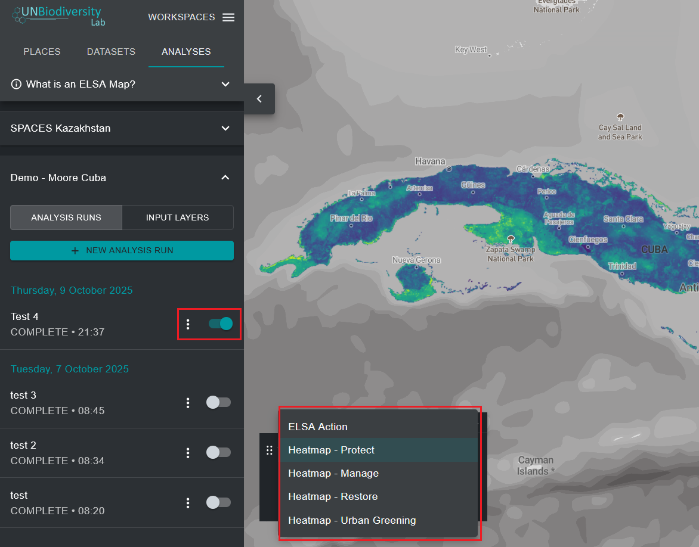

# Ver mapas de calor

Al ejecutar un análisis ELSA, podrá ver los resultados haciendo clic en los tres puntos verticales junto a la entrada de análisis en la pestaña izquierda y haciendo clic en el botón 'View'. En el menú desplegable de la leyenda que aparece en el mapa, puede elegir entre ver el mapa de acción final o las capas de mapa de calor. Sugerimos que vea primero los mapas de calor.

{#fig-viewing-hm}

Los mapas de calor identifican ubicaciones importantes para lograr los Objetivos 1-12 del KMGBF, u otros objetivos de política especificados por su país. Son la suma normalizada de los valores de las características de planificación en cada unidad de planificación, teniendo en cuenta los pesos de usuario dados a cada característica de planificación. Las áreas importantes (donde ocurren más características de planificación, ajustadas por ponderación) se muestran en una gama de colores de verde a amarillo, siendo las de amarillo brillante las más importantes. Los mapas de calor se pueden utilizar para identificar áreas donde la contribución general de las características de planificación a los Objetivos 1-12 del KMGBF es mayor.

Al evaluar los mapas de calor, los expertos en datos pueden ver los datos de características de planificación ponderados por el usuario agregados para determinar si los patrones coinciden con sus expectativas y conocimiento personal de la región. Para ayudar en este proceso, los usuarios pueden alternar entre los mapas de calor y las imágenes satelitales subyacentes/mapas de carreteras/mapas de características de planificación, lo que ayuda a orientar los mapas de calor en el paisaje e identificar qué características de planificación están contribuyendo específicamente a áreas de alta importancia para los objetivos del KMGBF.

!!! important
    Para alternar imágenes satelitales y carreteras, los usuarios deben hacer clic en el botón 'MAP CONTROLS' en la parte inferior derecha de la aplicación de datos de UNBL. Los usuarios pueden hacer clic en el ícono del ojo en el cuadro de leyenda para ocultar el mapa de calor y ver imágenes satelitales, o el botón de opacidad a la izquierda del ícono del ojo para reducir la opacidad del mapa de calor y ver imágenes satelitales subyacentes y el mapa de calor al mismo tiempo.

{#fig-eval-hm}
