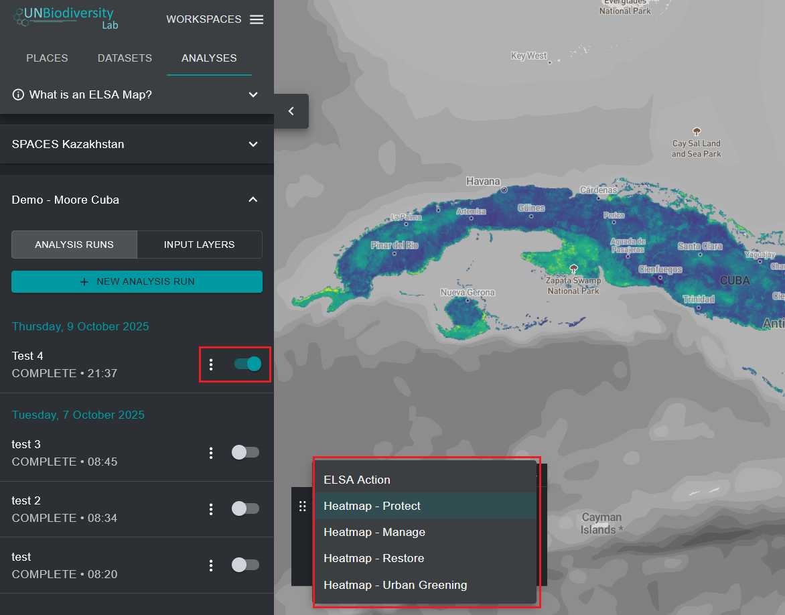
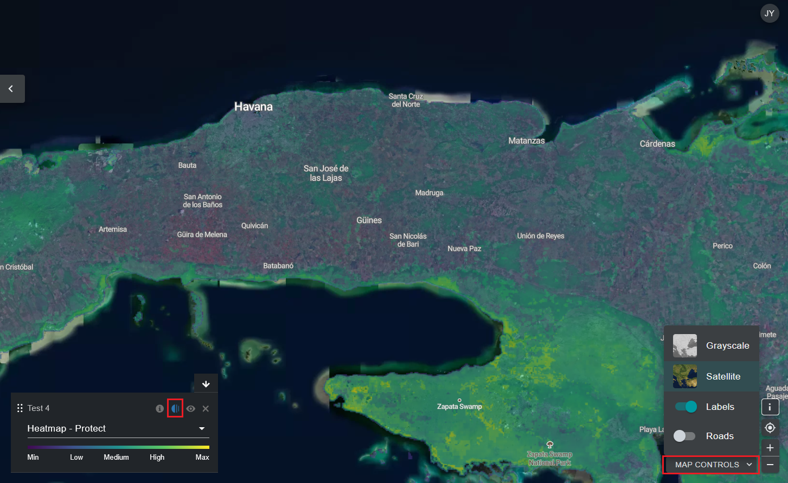

# Viewing heatmaps

Upon executing an ELSA analysis, you will be able to view results by clicking on the vertical three dots next to the analysis entry in the left tab and clicking on the ‘View’ button. In the drop-down menu of the legend that appears on the map, you can choose between viewing the final action map or heatmap layers. We suggest that you view the heatmaps first. 

{#fig-viewing-hm}

Heatmaps identify important locations for achieving KMGBF Targets 1-12, or other policy targets specified by your country. They are the normalised sum of planning features’ values in each planning unit, accounting for the user weights given to each planning feature. Important areas (where more planning features occur, adjusted for weighting) are shown in a range of colours from green to yellow, with those in bright yellow being the most important. Heatmaps can be used to identify areas where the overall contribution of planning features to KMGBF Targets 1-12 is greatest.

By evaluating heatmaps, data experts can view the aggregated user-weighted planning feature data to determine if the patterns match their expectations and personal knowledge of the region. To assist in this process, users can toggle between the heatmaps and underlying satellite imagery/road maps/planning feature maps, which helps orient the heatmaps on the landscape and identify which planning features are specifically contributing to areas of high importance for the KMGBF targets. 

!!! important
    To toggle satellite imagery and roads, users should click on the ‘MAP CONTROLS’ button on the bottom-right of the UNBL data app. Users can then click on the eye icon in the legend box to hide the heatmap and view satellite imagery, or the opacity button to the left of the eye icon to reduce the opacity of the heatmap and see underlying satellite imagery and the heatmap at the same time.  

{#fig-eval-hm}