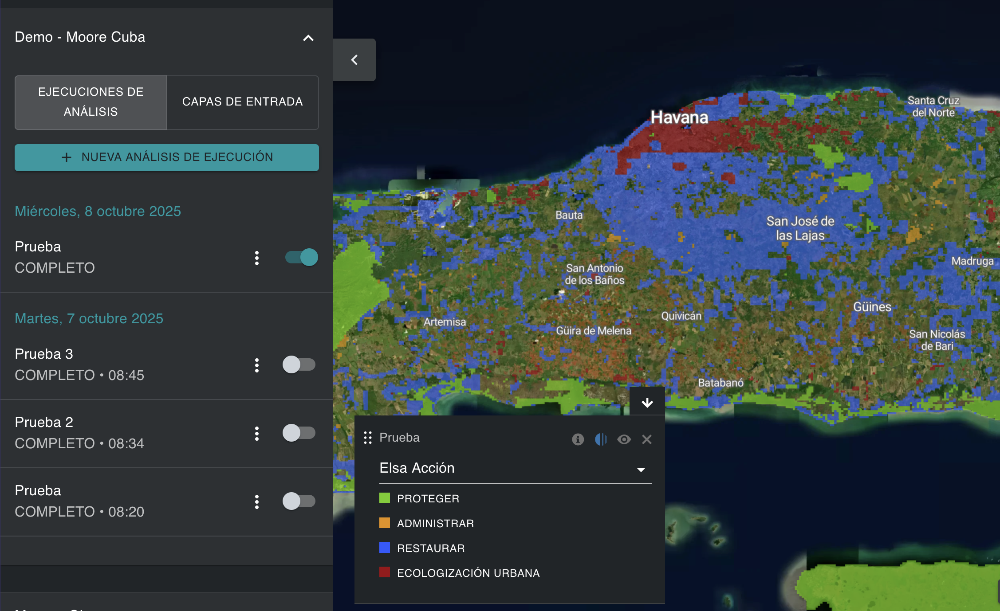
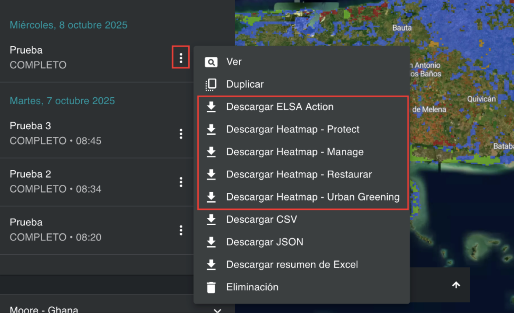

# Visualización y descarga de mapas de acción  

Después de ejecutar un análisis ELSA, puede ver el mapa de acción final asociado a esa versión del análisis alternando la ejecución del análisis en la pestaña izquierda. La capa «ELSA Acción» resultante que aparece en el mapa de forma predeterminada es el mapa de acción final que muestra las áreas prioritarias para las acciones de protección, restauración, gestión y/o ecologización urbana en su país que pueden contribuir mejor a los resultados de las Metas 1-12 del MMB-KM. Al igual que con los mapas de calor, los usuarios pueden ampliar áreas específicas utilizando la interfaz UNBL y alternar entre imágenes satelitales y otras capas disponibles en el espacio de trabajo/plataforma pública UNBL para evaluar los resultados finales.   

<figure markdown>

<figcaption>Figura 17. Mapa de acción que muestra las áreas prioritarias para la protección, restauración, y otros alrededor de Havana</figcaption>
</figure>

Los usuarios también pueden descargar los mapas de acción y los mapas de calor resultantes en formato ráster para su uso externo en software SIG de escritorio.   

<figure markdown>

<figcaption>Figura 18. Descargar los mapas de análisis resultantes</figcaption>
</figure>
