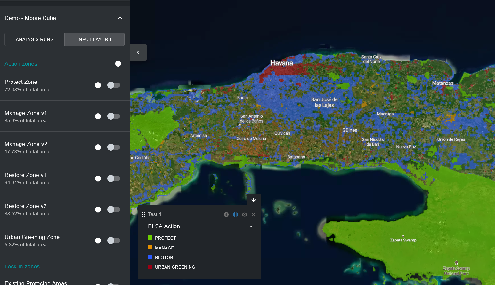
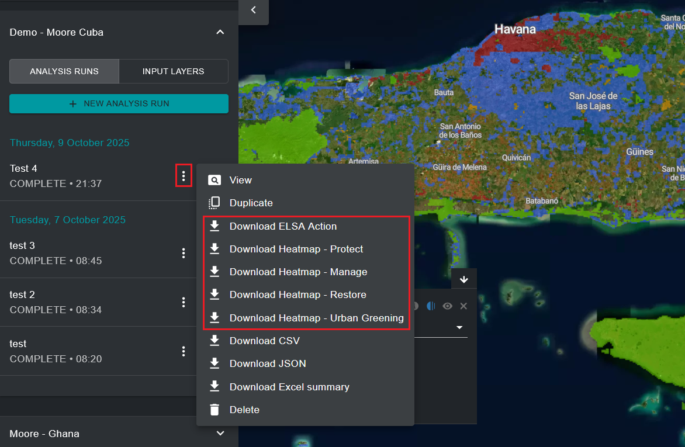

# Просмотр и загрузка карт действий ELSA

После выполнения анализа ELSA вы можете просмотреть финальную карту действий, связанную с этой версией анализа, переключив запуск анализа на левой вкладке. Результирующий слой 'ELSA Action', который появляется на карте по умолчанию, является финальной картой действий, которая показывает приоритетные области для действий по охране, восстановлению, управлению и/или озеленению городов в вашей стране, которые могут лучше всего способствовать результатам Целей 1-12 KMGBF. Подобно тепловым картам, пользователи могут увеличивать масштаб конкретных областей, используя интерфейс UNBL, и переключать спутниковые снимки, а также другие слои, доступные в рабочем пространстве/общедоступной платформе UNBL, для оценки финальных результатов.

Пользователи также могут загружать результирующие карты действий и тепловые карты в растровом формате для внешнего использования в настольном программном обеспечении ГИС.

