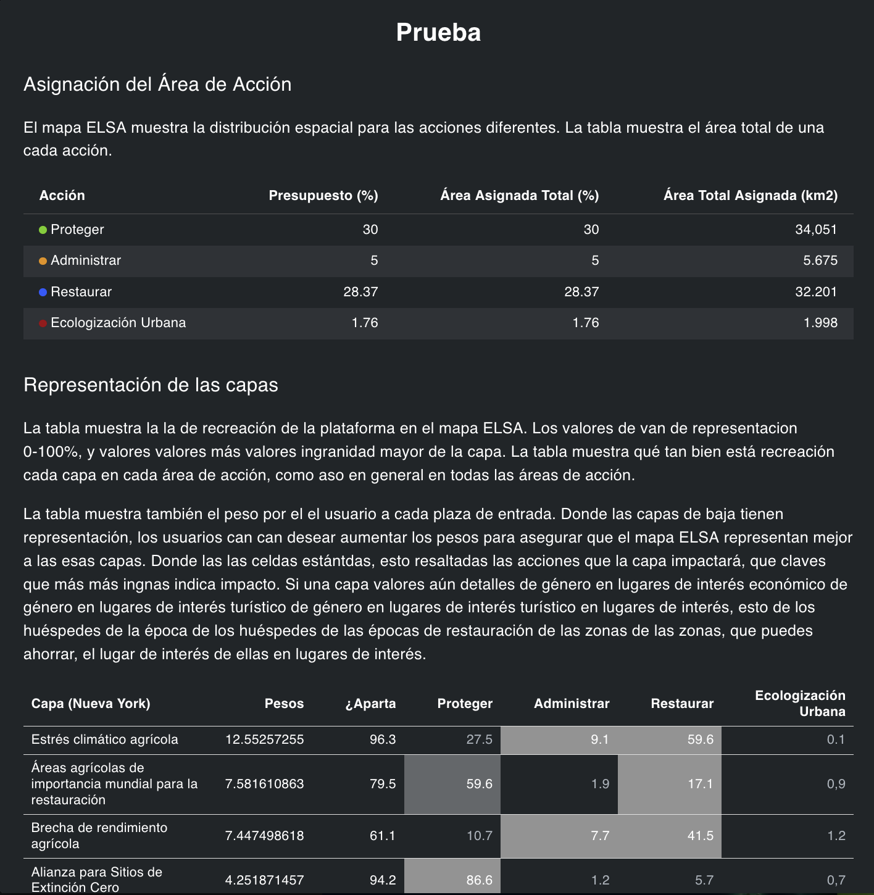
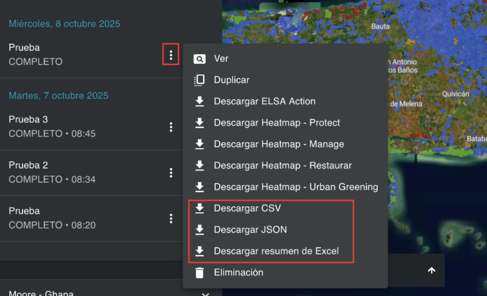

# Análisis de sinergias y compensaciones   

Uno de los resultados del análisis ELSA es identificar las sinergias entre las acciones para los objetivos del MMB-KM que abarcan la biodiversidad, el cambio climático y el bienestar humano. El análisis mide el resultado de cada característica de planificación con una puntuación de representación para mostrar dónde la planificación simultánea de todas las Metas del MMB-KM podría haber dado lugar a que algunas características de planificación específicas se representaran a un nivel inferior al de otras características. Donde, en los mapas temáticos:

$$
\text{Puntuación de representación} = \frac{\text{Representación en mapa de priorización}}{\text{Representación máxima}}
$$

Después de ejecutar un análisis, puede ver los resultados y evaluar si los parámetros seleccionados han dado lugar a una representación aceptable para cada una de las características de planificación.  

Puede revisar la representación de las características de planificación haciendo clic en el icono «**i**» en la leyenda de capas del análisis activado. Esto mostrará una ventana de información de prueba con la superficie total de tierra asignada a cada acción basada en la naturaleza en el análisis, así como una tabla que muestra la ponderación, la representación global y la representación individual de cada acción basada en la naturaleza para cada característica de planificación.   

<figure markdown>

<figcaption>Figura 19. Cuadro de información de representaciones de características</figcaption>
</figure>

También puede guardar esta misma información en su ordenador local haciendo clic en el botón de tres puntos verticales situado junto a la entrada de su ejecución de análisis y, a continuación, haciendo clic en «Descargar CSV» o «Descargar JSON», según el formato que desee. Además, puede hacer clic en «Descargar resumen de Excel» para descargar una hoja de información de prueba más completa que muestra descripciones de datos y metadatos para cada característica de planificación, descripciones de los objetivos políticos utilizados para el análisis y los recursos de análisis ELSA junto con las puntuaciones de representación.   

<figure markdown>

<figcaption>Figura 20. Descargar tabla resumen de representación de características</figcaption>
</figure>

Puede evaluar las puntuaciones de representación de las características de planificación que elija y duplicar y ejecutar iterativamente análisis adicionales con pesos aumentados/disminuidos para las características de planificación, dependiendo de si desea aumentar/disminuir su representación en el mapa ELSA final.   

