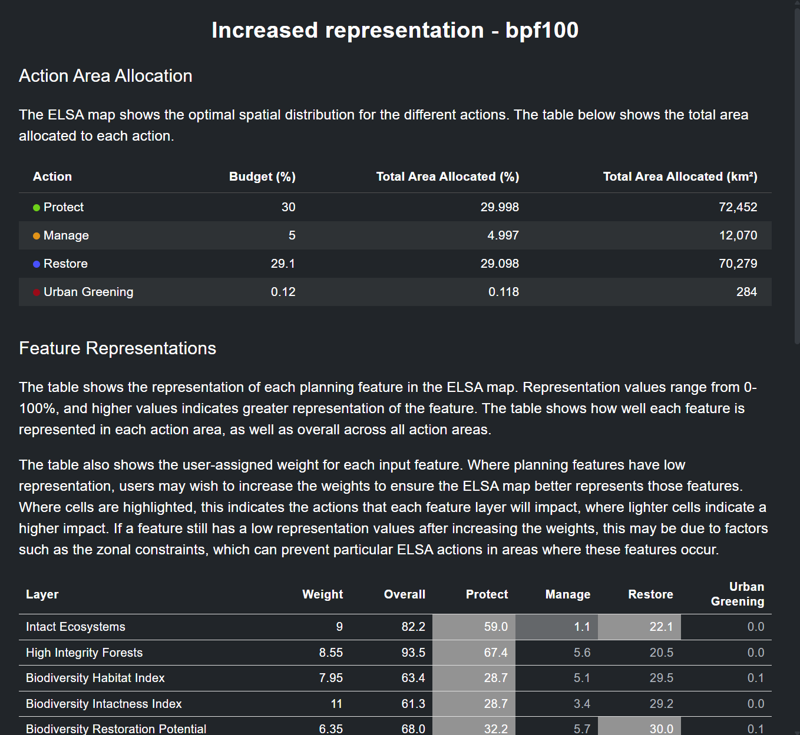

# Analizar sinergias y compensaciones

Un resultado del análisis ELSA es identificar sinergias entre acciones para los Objetivos del KMGBF que abarcan la biodiversidad, el cambio climático y el bienestar humano. El análisis mide el resultado de cada característica de planificación con una puntuación de representación para mostrar dónde la planificación para todos los objetivos del KMGBF simultáneamente podría haber llevado a que características de planificación específicas estén representadas a un nivel más bajo que otras características. Donde, en los mapas temáticos:

$$
\text{Puntuación de representación} = \frac{\text{Representación en mapa de priorización}}{\text{Representación máxima}}
$$

Después de ejecutar un análisis, puede ver los resultados y evaluar si los parámetros seleccionados condujeron a una representación aceptable para cada una de las características de planificación.

Puede revisar la representación de características de planificación haciendo clic en el ícono '**i**' en la leyenda de capa de la ejecución de análisis alternada. Esto mostrará una ventana de información de prueba con el área total de tierra asignada a cada acción basada en la naturaleza en el análisis, así como una tabla que muestra el peso, la representación general y la representación individual para cada acción basada en la naturaleza para cada característica de planificación.

Alternativamente, puede guardar esta misma información en su computadora local haciendo clic en el botón de tres puntos verticales junto a la entrada de su ejecución de análisis y luego haciendo clic en 'Download CSV' o 'Download JSON', dependiendo del formato que desee. Además, puede hacer clic en 'Download Excel summary' para descargar una hoja de información de prueba más completa que muestra descripciones de datos y metadatos para cada característica de planificación, descripciones de objetivos de política utilizados para el análisis y recursos de análisis ELSA junto con las puntuaciones de representación.

Puede evaluar las puntuaciones de representación para las características de planificación de su elección y duplicar y ejecutar iterativamente ejecuciones de análisis adicionales con pesos aumentados/disminuidos para las características de planificación dependiendo de si desea aumentar/disminuir su representación en el mapa ELSA final.
