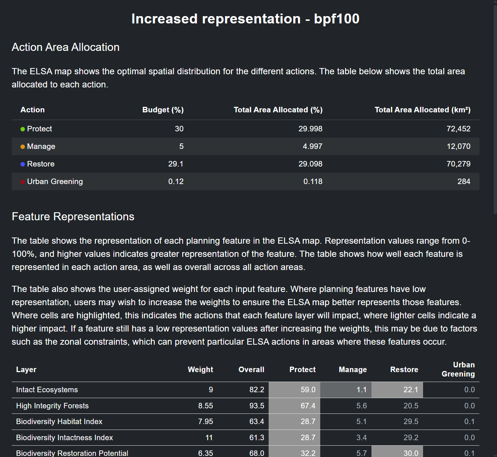
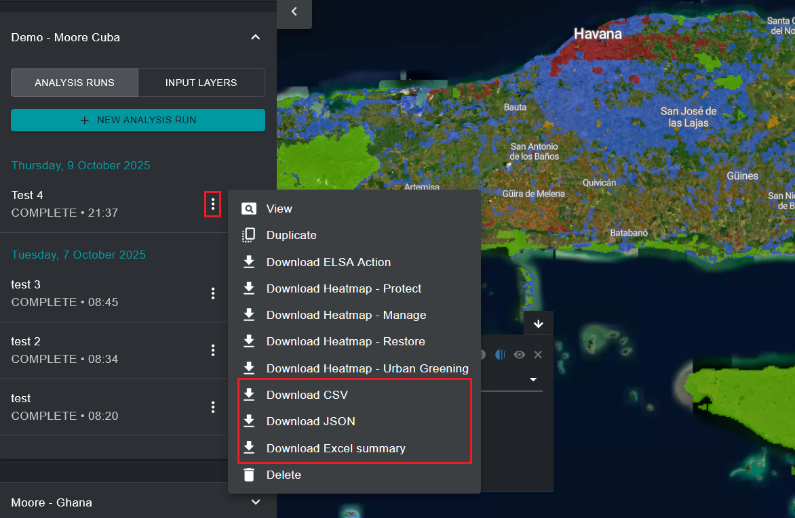

Analysing synergies and trade-offs
==================================

One outcome of the ELSA analysis is to identify synergies among actions for KMGBF Targets that span biodiversity, climate change and human well-being. The analysis measures the outcome of each planning feature with a representation score to show where planning for all KMGBF targets simultaneously might have led to specific planning features being represented to a lower level than other features. Where: 

.. math::

   \text{Representation score} = \frac{\text{Representation in prioritization map}}{\text{Maximum representation}}
   
in the thematic maps. 

After running an analysis, you can view the results and evaluate whether the parameters selected led to an acceptable representation for each of the planning features. 

You can review planning feature representation by clicking the ‘**i**’ icon in the layer legend of the toggled analysis run. This will display a test information window with the total land area allocated to each nature-based action in the analysis, as well as a table showing the weight, overall representation and individual representation for each nature-based action for each planning feature. 

   
   Figure 19. Feature representations info box.

You can alternatively save this same information to your local computer by clicking on the three vertical dots button next to the entry of your analysis run and then clicking on ‘Download CSV’ or ‘Download JSON’, depending on the format you desire. You can additionally click on ‘Download Excel summary’ to download a more comprehensive test information sheet which shows data descriptions and metadata for each planning feature, descriptions of policy targets used for the analysis, and ELSA analysis resources alongside the representation scores.  

   
   Figure 20. Download feature representation summary tables.

You can evaluate representation scores for planning features of your choice and iteratively duplicate and run additional analysis runs with increased/decreased weights for planning features depending on whether you want to increase/decrease their representation in the final ELSA map.  