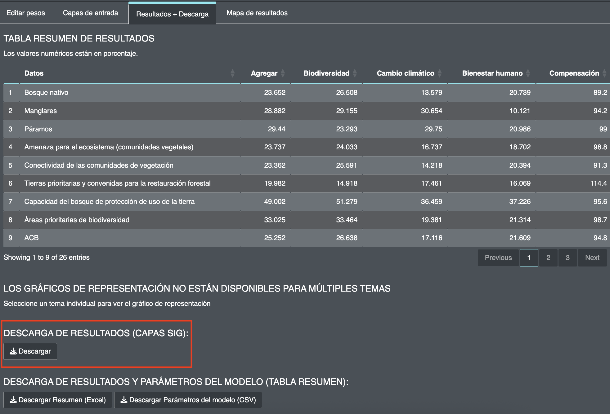

2.11 Viewing and downloading maps
=================================

After running the optimization, you will be able to view and download 8 result maps in raster format, of which 4 correspond to heatmaps and 4 correspond to spatial prioritization maps for your country based on the results of the analysis to identify priority areas for the implementation of the GBF in Ecuador.

.. image:: images/table3.png
    :align: center
    :alt: Table 3

Table 3. Spatial prioritization maps identifying priority areas for GBF implementation available for download on the Prioritizing Nature webtool.

**Steps**

1.	Click on the fourth tab *"Results Map"* to view the ELSA spatial prioritization maps in the webtool.
2.	Zoom in on certain areas by clicking on the "+" icon.
3.	You can switch to different basemap views by clicking on the layers icon located on the left, three basemap options will be displayed including the satellite view, click on the basemap of your interest to enable the layer (Figure 12).

.. image:: images/12basemap.png
    :align: center
    :alt: Figure 12.  Base map options

Figure 12.  Base map options

4.	To download the maps in raster or GeoTIFFs format, which can be viewed and analyzed in GIS software. Click on the "Results + Download" tab and then on "Download results (GIS layers)" to download the result maps (Figure 13).

Figure 13.  Downloading result maps

.. important::
    When using the spatial prioritization map in a formal report or publication, please use the following citation:
    
    **MAATE and UNDP 2025. Prioritizing Nature Project. Map created using spatial data and the Prioritizing Nature in Ecuador webtool https://elsa.unbiodiversitylab.org/Bezos_ECU/ , on [insert date with Day Month Year].**

