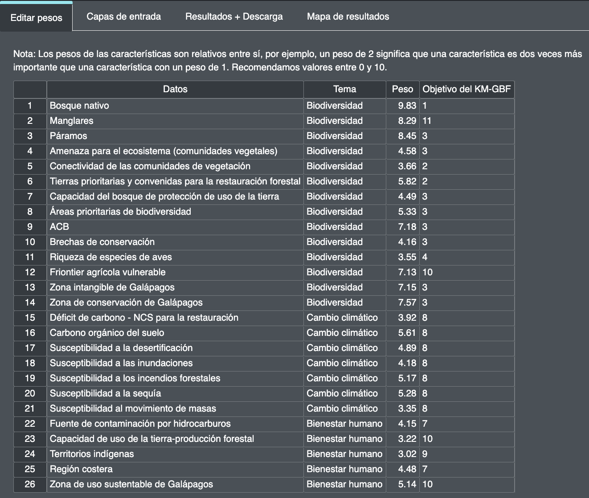

# 2.6 Editing the weights of planning features

To carry out the optimization analysis, stakeholders have to decide the comparative importance of each of the planning features that outline the priority ENDB targets for Peru. This is achieved through weighting. For example, if biological corridors that help connect protected areas and crucial wildlife habitats are considered to be of high importance, this planning feature should be given greater weight (>3).

!!! important
    The default weights found in the tool are based on the weights obtained from stakeholders composed of a diverse  group of policy makers, experts and other stakeholders in your country.

**Steps**

1.	Enter a weighting for each planning feature. We recommend a scale of 0 to 10 as follows, based on the priority level of each planning feature:

    - 0 : not important / not taken into account
    - 1.0 : low importance / lower importance than average
    - 5.0 : medium importance
    - 10 : utmost importance
  

Figure 6. Editing weights

