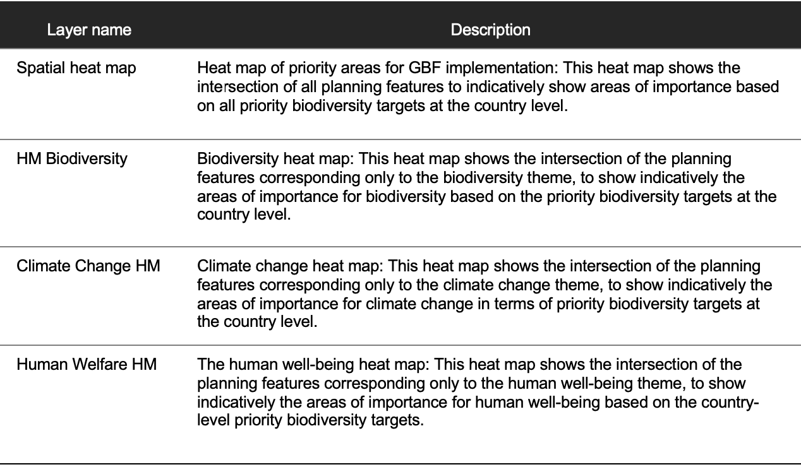
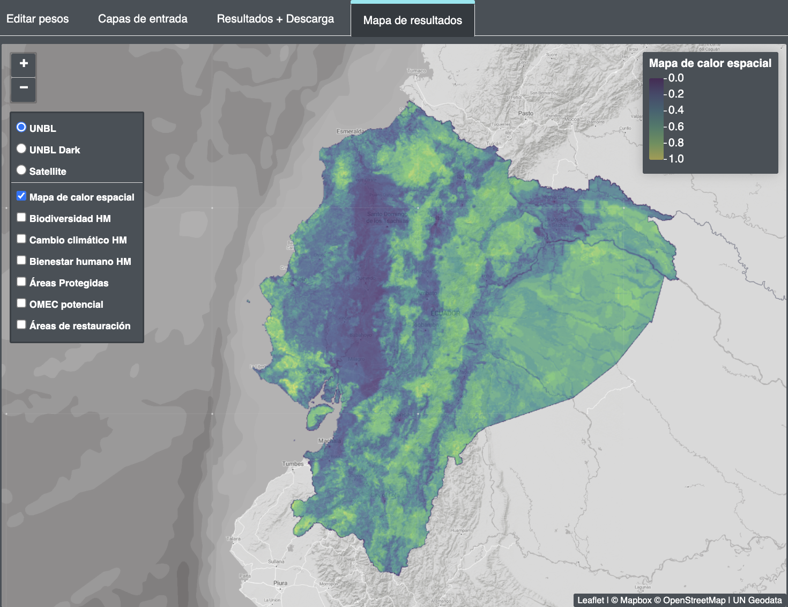

# 2.8 Viewing heatmaps or opportunity maps

Before running the optimization, clicking on the "Results Map" in the right panel will create four heat map (HM) layers. The heat maps identify important locations for the nine biodiversity targets of the GBF for Ecuador . They are the result of the intersection of the planning features and their respective weightings. The higher the value in a range from zero to one, the more elements with high weights overlap. Thus, they can be identified as hotspots for biodiversity, climate change , human well-being or all of them combined.

The heat maps can be toggled on and off, to view the heat map of priority areas for GBF implementation, which shows all planning features together (spatial heat map), or the heat maps that show only the planning features within specific themes (biodiversity, climate change , human well-being). Important areas are shown in a range of colors from green to yellow, with those in yellow being the most important.

!!! note
    By looking at the heat maps before the prioritization maps, data experts can view the combined data from the planning features and determine if the patterns match their expectations and personal knowledge of the region.

To assist in this process, users can toggle between the heat maps and the underlying satellite imagery and road maps, which helps orient the heat maps on the landscape. There are four types of heat maps in the Ecuador webtool (Table 2).

Table 2. Types of heatmaps in the Ecuador webtool.

**Steps**

1.	Click on the "Results Map" tab in the right pane. 
2.	Toggle between the four heat maps to review the information before running the optimization.
3.	Experiment with changing the view to the "Satellite" view.

Figure 8. Heatmap of all planning features