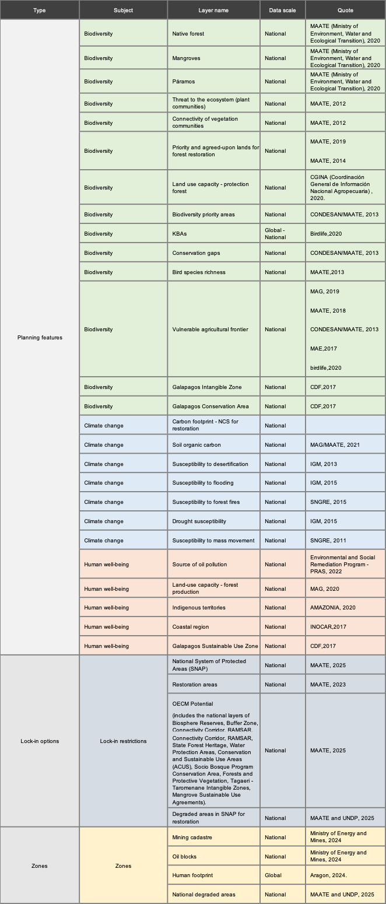

3. Annexes
===========
3.1 Key terms used in the process of mapping priority areas for the implementation of the GBF in Ecuador.
--------------------------------------------------------------------------------------------------------------
.. list-table::
   :header-rows: 1
   :widths: 10 50 40

   * - Term
     - Definition
     - Application in Ecuador

   * - Boundary Penalty Factor (BPF)
     - Solutions are penalized based on the total outer boundary or edge
  
       of the zones. By penalizing solutions with large edge length, this BPF

       can be used to promote spatial cohesion or clustering in the spatial

       prioritization zones of priority areas for GBF implementation.

     - A boundary penalty of 10 was applied to produce the second spatial

       prioritization map. This score was selected to create a scientifically

       rigorous but actionable map that promotes protection, management,

       and restoration in contiguous areas.

   * - Objective based on areas (budget)
     - The maximum area (expressed as a % of the total area of the country)
  
       that can be assigned to an "area".
     - Protect: 30%.

       Restore: 8.99%

       Manage: 10%

   * - Planning feature
     - An element of biodiversity or ecosystem service selected as a focus
  
       for conservation planning or action. It may include ecological classifications,

       habitat types, species, physical objects, processes, or any element

       that can be measured in a planning unit. In the process of spatial

       prioritization of priority areas for GBF implementation, each priority

       commitment for a country may correspond to one or more planning

       features depending on its complexity.

     - The Prioritizing Nature for Ecuador webtool contains 16 planning features
  
       that map the 9 biodiversity targets of the GBF.

   * - Decision support software
     - A computer application that uses information about possible actions and
  
       the limitations of those actions to assist the decision-making process in

       achieving a stated objective.

     - For the Prioritizing Nature in Ecuador project, prioritizr is used as
  
       decision support software.

   * - Geographic Information System (GIS)
     - Computer system consisting of hardware and software necessary for the
  
       capture, storage, management, analysis and presentation of geographic

       (spatial) data.

     - The Prioritizing Nature webtool uses GIS software to present spatial
  
       data to users. No GIS knowledge is required to use it.

   * - Restrictions
     - A constraint that must be met during optimization, as it creates a network
  
       of areas. The main constraints are that the budget (land area devoted to

       each spatial prioritization action) is not exceeded and that each zone can

       only occur within specified planning units (e.g. the protection zone can only

       be possible in planning units that are not agricultural or urban coverage).

     - For more details, see Table 1.

   * - Planning units
     - Planning units are the basic elements of a reserve system. A study area is
       
       divided into planning units that are smaller geographic parcels of regular
       
       or irregular shapes. Examples are squares, hexagons, cadastral parcels and
       
       hydrological units.
     - Coordinate Reference System: Custom Mollweide

       Pixel resolution or pixel size: 600x600m

   * - Representation
     - In Systematic Conservation Planning, a representative system captures the
       
       full range of planning features (species, ecosystems, and ecosystem services)
       
       occurring in the planning region, not just iconic species.

     - In Ecuador's spatial prioritization analysis, the representation is used to
       
       measure how well the priority areas for GBF implementation capture or
       
       represent the elements of planning relative to a more targeted planning
       
       approach focused solely on biodiversity, climate change or human well-being.

   * - Systematic Conservation Planning (SCP)
     - A formal method for identifying potential areas for conservation management
       
       that will most efficiently achieve a specific set of objectives, commonly some
      
       minimum representation of biodiversity. The process involves a clear and
       
       structured approach to priority setting, and is now the norm for both terrestrial
      
       and marine conservation. The effectiveness of systematic conservation
      
       planning lies in its ability to make the best use of limited fiscal resources to
      
       achieve conservation objectives and to do so in a way that is defensible,
      
       accountable, and transparently recognizes the needs of different resource users.
     - The SCP is the science that allows the identification of spatial prioritization
      
       areas for the implementation of the GBF in Ecuador.

   * - User interface
     - The means by which people interact with a given computer application.
       
       A Graphical User Interface (GUI) presents information in a simple way
       
       using graphics, menus and icons.
     - The Prioritizing Nature webtool is a graphical user interface that gives
      
       stakeholders the ability to run the spatial prioritization analysis themselves.

   * - Weights
     - The weights allow users to set relative priorities within their priority policy
       
       outcomes. Values typically range from "0" (no importance) to "10"
      
       (extremely high importance).
     - The default weightings for the Ecuador spatial prioritization analysis were
      
       developed collaboratively through stakeholder engagement sessions.
      
       Stakeholders can modify these weightings through the Prioritizing
      
       Nature webtool based on changes in priorities.

   * - Zones/Shares
     - A land use zone, equivalent to a nature-based action, which serves to
       
       enhance specific planning objects. Zones are determined by restrictions that
      
       define where an action may or may not absolutely occur. For example, these
      
       hard restrictions limit protection to intact areas (e.g., low human footprint
      
       values) and protection/restoration to areas that are moderately impacted by
      
       human activity, but not totally dominated by humans (e.g., low and medium
      
       human footprint values).
     - In Ecuador, the spatial prioritization analysis zoning maps three different
       
       actions: protect, manage and restore.

       Data used for zoning constraints include human footprint, degraded areas,
       
       protected areas, urban areas and agricultural areas.

3.2 Data layers used in the Prioritizing Nature project in Ecuador
--------------------------------------------------------------------

