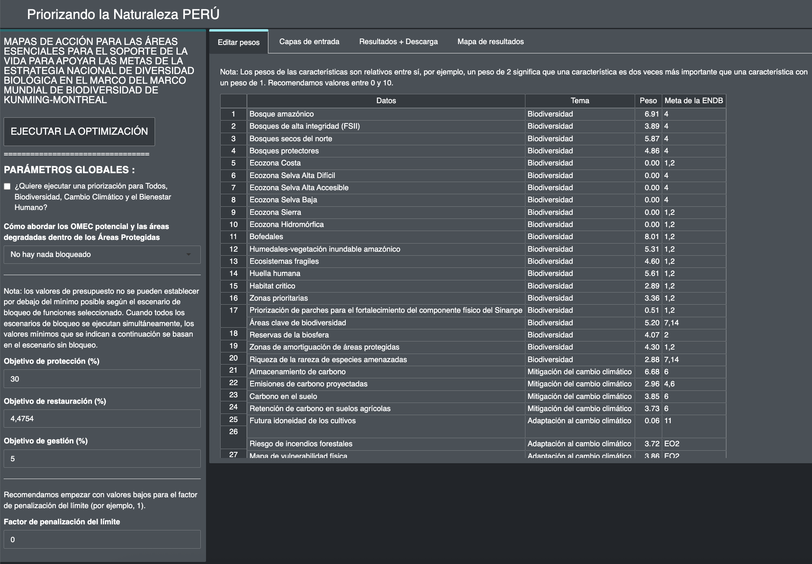

2.1 What is the Prioritizing Nature webtool for?
=========================================================
The Prioritizing Nature webtool is an interactive webtool created with *R-shiny* and connected to *prioritzr* in the backend. This tool can be used by interested Parties without the need for coding or modeling knowledge, with the same it achieves the automation of steps 5, 6 and 7 of the ELSA mapping process presented in Figure 1.

.. image:: images/1workflow.png
    :align: center
    :alt: Workflow for the ELSA mapping in the Prioritizing Nature project.

Figure 1. Workflow for the ELSA mapping in the Prioritizing Nature project.

.. admonition:: The Prioritizing Nature webtool applications
    
    - Display the input layers or planning element;
    - View and download the resulting maps;
    - Create ELSA action maps;
    - Download the result maps in raster format, which can be used for further analysis according to the needs of the interested parties in software from Geographic Information Systems (GIS).
    - Download results and parameters of the model applied in the analysis as a summary table, which are downloaded in .xlsx and .csv formats, which can be used in Excel or other tools.
    - Create different ELSA action, by modifying the parameters related to the percentage (%) of the national territory allocated to protection, restoration and management target actions. These configurations can be adapted to the country's political objectives in terms of conservation, restoration, protection, among others.
    - Edit the penalty limit factor parameter according to the analysis needs;
    - Edit the weights of each of the input layers or planning elements;
    - Create prioritization maps with a new stakeholder group;
    - Re-run ELSA analysis with updated input layers.

The web-based tool executes optimizations quickly (typically within 5-10 minutes). It can therefore be used to generate and refine conservation plans in real time during stakeholder meetings, and contribute to a more transparent, inclusive and participatory decision-making process.

Figure 2. Interface of the Prioritizing Nature Peru webtool.

.. important:: 
    Access the Prioritizing Nature Peru webtool `here <https://elsa.unbiodiversitylab.org/Bezos_PER/>`_