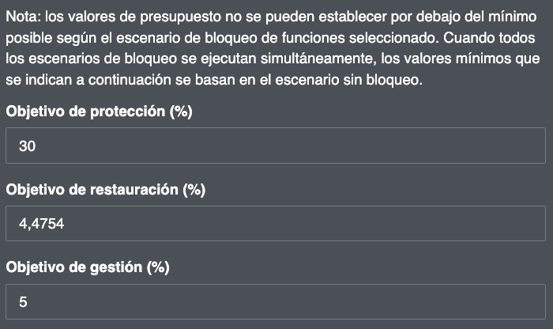
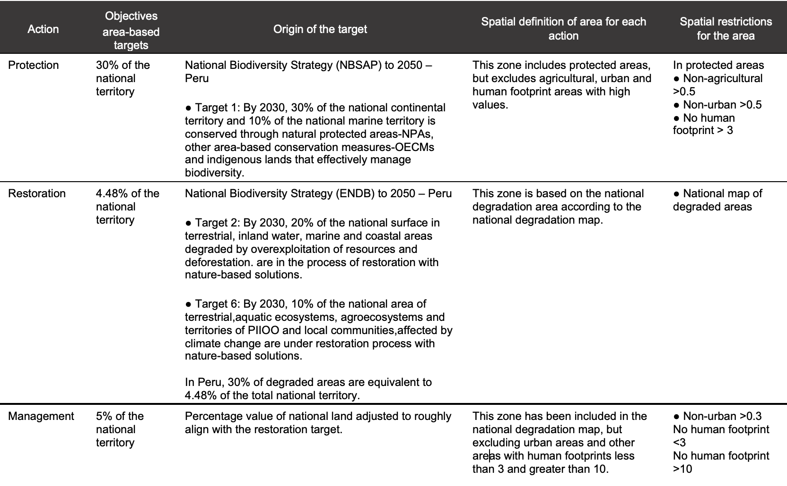

2.4 Objectives
=========================================================
This part of the ELSA webtool to identify priority areas to support the implementation of the ENDB allows you to set area-based targets for protection, restoration, and management. Targets can also be understood as the percentage of land area that can be allocated to each action within the country. The default values in the Prioritizing Nature webtool are derived from the targets in the ENDB in Peru (see Table 1).

**Steps**

1.	Set any value greater than or equal to 0.001 for protection, restoration and management objectives. The sum of the value for all objectives may be less than or equal to 100%, but should not exceed 100%.

.. important:: 
    Currently, about 17.37% of Peru has potential OECM coverage. Therefore, if you select "block potential OECM", the protection target here should be at least 17.37%.

Figure 4. Setting objectives

The lock-in restrictions used in Peru to spatially define where each of these actions can occur are summarized in the below table.

Table 1. Area-based actions and objectives used in the spatial prioritization analysis to support ENDB targets.