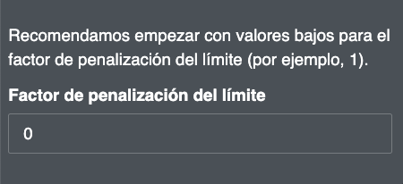

# 2.5 Boundary penalty factor

The boundary penalty factor is used to promote spatial cohesion when prioritizing land use zones. The boundary penalty can be 0 or higher. The higher the value, the more connected and contiguous the prioritization action zones will be on the map, making it more enforceable. This adjustment is based on the idea that, for real-world planning, a more connected zone is usually easier to manage and execute actions.

!!! note
    The global science team used a boundary penalty factor of 50 on the ELSA map for Peru.

**Steps**

1.	To set the limit penalty, start with a very small number, e.g. 0.00001.
2.	Increase the number iteratively, i.e., rerun the optimization repeatedly, by an order of magnitude (e.g., 0.00001 -> 0.0001 -> 0.001), reducing the rate of increase as you approach solutions that lead to your desired level of clustering. Each time you change the penalty, you will have to rerun the optimization until you arrive at a map that is sufficiently contiguous to meet your needs.

Figure 5. Adjustment of the boundary penalty factor 
