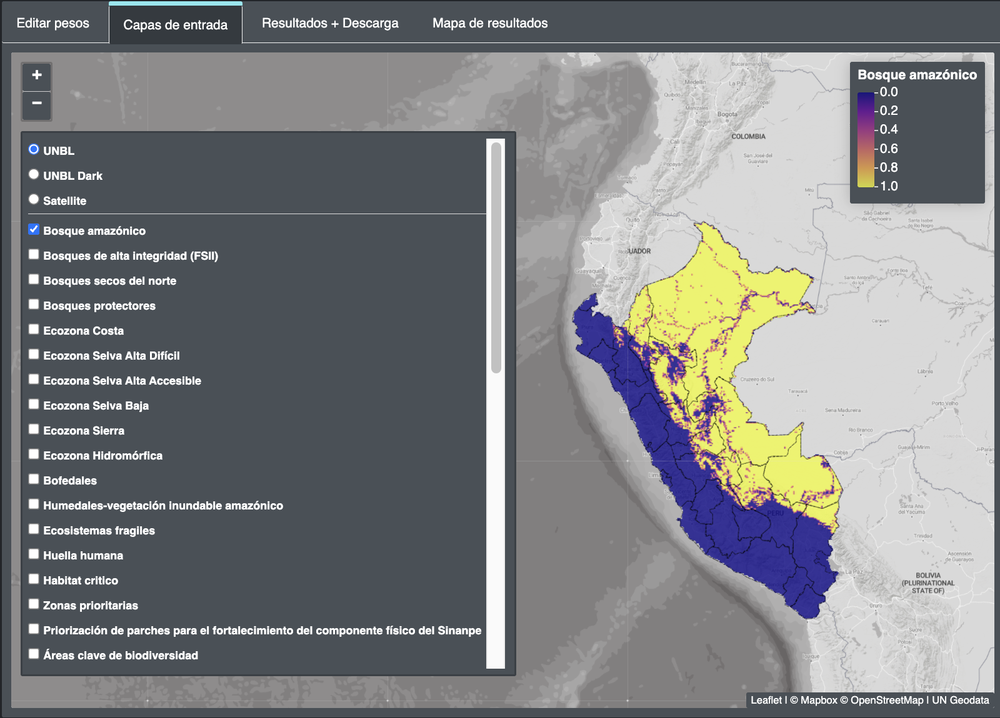

# 2.7 View input layers

By clicking on *"Input Layers"*, users can view maps of the **40 planning features** included in the ELSA analysis to identify priority areas for ENDB implementation.

**Steps**

1.	Check the box for each planning feature layer you want to display. 
2.	Uncheck the box to remove the planning feature layer from the view.

Figure 7. View input layers
