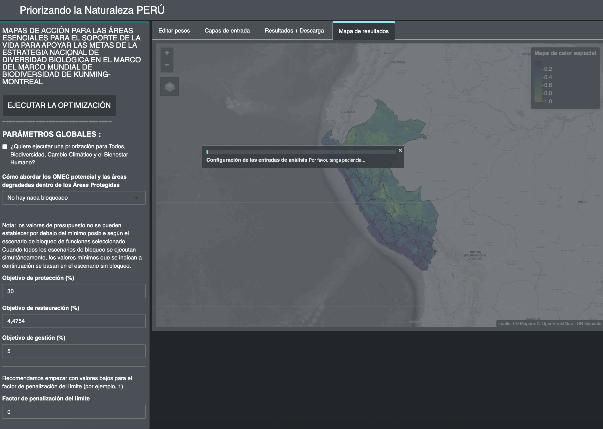

2.9 Running the optimization
=========================================================
The ELSA actionmap shows the priority areas for the implementation of the ENDB for protection, restoration and management actions. The optimization executed by the webtool follows three rules to create the best possible map:

- It should not exceed area-based targets;
- It must include the selected locks or non-blocks;
- It should include the best combination of planning features based on the distribution and weighting of planning features (heat map).

Once you have customized the above parameters and reviewed the heat maps, you can run the optimization analysis.

**Steps**

1.	Prior to running the optimization, you can choose to check the box under *"Global parameters"* (Figure 9). By first checking this box, and then running the optimization, you will be able to view four maps:
    
    - The final ELSA actionmap, which contains the nature-based actions that are optimized for benefits in all planning features;
    - One map optimized for the biodiversity planning features,
    - One map optimized for climate change, 
    - One mapa optimized for human well-being.

Conversely, if you only want to display the final ELSA actionmap, you should leave this box unchecked.

Figure 9. Optimization and global parameters

2.	Click on the *"Run optimization"* button (Figure 10). The analysis may take between 1 and 3 minutes to run. However, if the country is large (resulting in more planning units), there are a large number of planning features being used, or a high Boundary Penalty Factor is applied, it may take much longer. You should see a progress bar documenting the status of the analysis. You should not click "Run optimization" again while the analysis is running.
3.	Each time you change any parameter, click again on "run optimization" to run the model and update the results report and the map.

Figure 10. Optimization process
