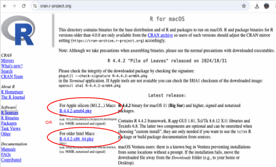

MacOS users
===========

1.  Click on `Download R for macOS <https://cran.r-project.org/bin/macosx/>`_.

2. Choose the version relevant to your operating system. 

----

.. note:: 

    - If you have the new M1, M2, .. powered Mac, you will need to download the Arm version `R-4.4.2-arm64.pkg <https://cran.r-project.org/bin/macosx/big-sur-arm64/base/R-4.4.2-arm64.pkg>`_; 
    - if you have older Intel Macs you will need to download the `R-4.4.2-x86_64.pkg <https://cran.r-project.org/bin/macosx/big-sur-x86_64/base/R-4.4.2-x86_64.pkg>`_ version.

3.  An installer will download and guide you through the installation process. The installer allow you to customise your installation, but the defaults will be suitable for most users. If your computer requires a password before installing new programs, you will need it here.
