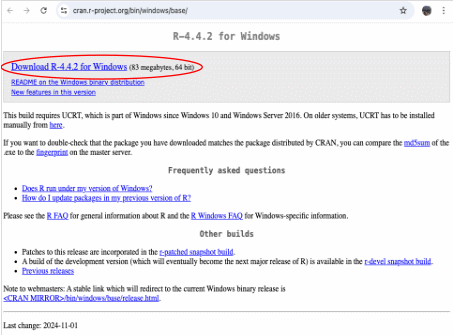

Windows users
=============

1.  Click on `Download R for Windows <https://cran.r-project.org/bin/windows/>`_.

.. image:: images/windows_os/image1.gif
    :alt: image1
    :align: center

-----
    
2.  Select the `base <https://cran.r-project.org/bin/windows/base/>`_ version. This will link to where you can can download the file.

.. image:: images/windows_os/image2.gif
   :alt: image2
   :align: center

----

3.  Click on `Download R-4.4.2 for Windows <https://cran.r-project.org/bin/windows/base/R-4.4.2-win.exe>`_ (the current version at the time of writing). The link will download an installer program, which installs the most up-to-date version of R for Windows. 

----

4.  Run the downloaded program and step through the installation wizard that appears. The wizard will install R into your program files folders and place a shortcut in your Start menu.

Additional installations
------------------------

For Windows users we also recommend installing the `RTools <https://cran.r-project.org/bin/windows/Rtools/rtools44/rtools.html>`_  package. *RTools* is toolchain bundle used for building *R* packages from source, which may require a software compiler that may not be available on most Windows systems.

.. note:: 
    These compilers (Xcode, GCC, C++, Fortan, etc.) are often/typically installed on MacOS and Linux systems, so this extra installation does not apply to you if your systems runs either of these OS.

To download RTools, click the `Rtools44 installer <https://cran.r-project.org/bin/windows/Rtools/rtools44/files/rtools44-6414-6401.exe>`_ link, download the file, run it, and follow the installation instructions.