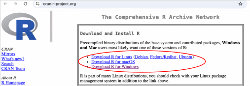
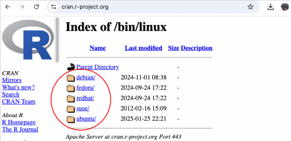

# Instalación de R

La instalación de R en su máquina es sencilla. Siga estos pasos:

1. Vaya al sitio web de [CRAN](http://cran.r-project.org) (Comprehensive R Archive Network). Si escribe "r" en Google, es la primera entrada

2. Siga las instrucciones a continuación según su sistema operativo:

??? example "Windows"
    1. Haga clic en [Descargar R para Windows](https://cran.r-project.org/bin/windows/).

    

    2. Seleccione la versión [base](https://cran.r-project.org/bin/windows/base/). Este enlace lo llevará a donde puede descargar el archivo.

    

    3. Haga clic en [Descargar R-4.4.2 para Windows](https://cran.r-project.org/bin/windows/base/R-4.4.2-win.exe) (la versión actual al momento de escribir). El enlace descargará un programa instalador, que instala la versión más actualizada de R para Windows.

    

    4. Ejecute el programa descargado y siga el asistente de instalación que aparece. El asistente instalará R en sus carpetas de archivos de programa y colocará un acceso directo en su menú Inicio.

    **Instalaciones adicionales**

    Para usuarios de Windows, si planea usar el optimizador *Gurobi* que se utilizará en el entrenamiento 5, también necesitará instalar el paquete [RTools](https://cran.r-project.org/bin/windows/Rtools/rtools44/rtools.html) para habilitar la instalación de *Gurobi* en *R* desde la fuente (si no planea usar *Gurobi*, puede ignorar este paso). *RTools* es un conjunto de herramientas utilizado para compilar paquetes de *R* desde la fuente, que puede requerir un compilador de software que puede no estar disponible en la mayoría de los sistemas Windows.

    !!! note
        Estos compiladores (Xcode, GCC, C++, Fortran, etc.) a menudo están instalados en sistemas MacOS y Linux, por lo que esta instalación adicional no se aplica si su sistema ejecuta cualquiera de estos sistemas operativos.

    Para descargar RTools, haga clic en el enlace del [instalador de Rtools44](https://cran.r-project.org/bin/windows/Rtools/rtools44/files/rtools44-6459-6401.exe), descargue el archivo, ejecútelo y siga las instrucciones de instalación.

??? example "macOS"

    1. Haga clic en [Descargar R para macOS](https://cran.r-project.org/bin/macosx/).

    2. Elija la versión relevante para su sistema operativo.

       

    !!! note
        - Si tiene un Mac con chip M1, M2 o superior, necesitará descargar la versión Arm [R-4.4.2-arm64.pkg](https://cran.r-project.org/bin/macosx/big-sur-arm64/base/R-4.4.2-arm64.pkg)
        - Si tiene un Mac Intel más antiguo, necesitará descargar la versión [R-4.4.2-x86_64.pkg](https://cran.r-project.org/bin/macosx/big-sur-x86_64/base/R-4.4.2-x86_64.pkg)

    3. Se descargará un instalador que lo guiará a través del proceso de instalación. El instalador le permite personalizar su instalación, pero los valores predeterminados serán adecuados para la mayoría de los usuarios. Si su computadora requiere una contraseña antes de instalar nuevos programas, la necesitará aquí.

??? example "Linux (x64/armlinux64)"

    1. *R* viene preinstalado en muchas distribuciones de Linux, pero necesitará tener la versión más actualizada de *R* instalada.

    2. Para actualizar su versión de *R*, o en caso de que necesite instalarlo por primera vez, haga clic en [Descargar R para Linux](https://cran.r-project.org/bin/linux/); el sitio web de CRAN proporciona archivos para compilar *R* desde la fuente o desde los repositorios oficiales en sistemas basados en Debian, Fedora, Redhat, SUSE y Ubuntu. Simplemente seleccione su distribución de Linux requerida y luego siga el directorio hasta la versión de Linux en la que desea instalar.

    

    Por ejemplo, las distribuciones basadas en Ubuntu (por ejemplo, Ubuntu, Linux Mint, etc.) se pueden instalar a través de apt agregando el repositorio CRAN, de la siguiente manera:

    ```r
       # actualizar índices
       sudo apt update -qq
       # instalar dos paquetes auxiliares que necesitamos
       sudo apt install --no-install-recommends software-properties-common dirmngr
       # agregar la clave de firma (por Michael Rutter) para estos repositorios
       # Para verificar la clave, ejecute gpg --show-keys /etc/apt/trusted.gpg.d/cran_ubuntu_key.asc
       # Huella digital: E298A3A825C0D65DFD57CBB651716619E084DAB9
       wget -qO- https://cloud.r-project.org/bin/linux/ubuntu/marutter_pubkey.asc | sudo tee -a /etc/apt/trusted.gpg.d/cran_ubuntu_key.asc
       # agregar el repositorio de CRAN -- lsb_release se ajusta a 'noble' o 'jammy' o ... según sea necesario
       sudo add-apt-repository "deb https://cloud.r-project.org/bin/linux/ubuntu $(lsb_release -cs)-cran40/"
       # instalar R
       sudo apt install --no-install-recommends r-base
    ```

    4. El procedimiento de instalación exacto variará según la distribución de Linux que use. CRAN guía el proceso agrupando cada conjunto de archivos fuente con documentación o archivos README que explican cómo instalar en su sistema.

    5. Si es usuario de Linux, ¡probablemente ya sepa todo esto! Disculpas.

!!! important
    Si ya tiene *R* instalado, asegúrese de que se haya actualizado recientemente.
