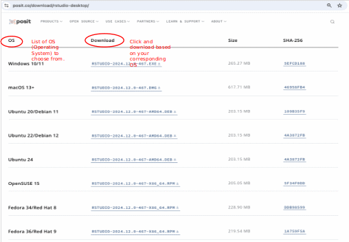

# Installing *RStudio*

*R* is not a program like Microsoft Word or Google Chrome that a user simply opens and starts doing some work with. Rather, *R* is a computer language, much like *C++*, *Python*, or *Java Script*, etc., whereby commands (in the *R* language in our case) are passed to the operating system, which in turn is able to interpret them (using an interpreter) and provide responses (this can be as simple as adding [2 + 2` or as complex as sending queries to your favourite AI chat bot asking where the nearest phở restaurant is to eat at tonight). There are various front-end coding environments (called IDEs, or Integrated Development Environments) which can be used to interact with *R*, but the most common *R* IDE is a program developed by `Posit ](https://posit.co/) called *RStudio* - *RStudio* will be used in all the Prioritizing Nature project training series.

## If R works via the command line, why use an IDE like RStudio instead?

-   The *R* CLI (command line interface), while fully running *R*, has very limited other features.
-   RStudio is available for free for use with Windows, macOS, and Linux operating systems - **cost is not an issue**. 
-   Its interface and all-in-one place design make working with *R* easier, more productive, and more organized. This is especially true for new users. 
-   *RStudio* is able to easily run [RShiny ](https://shiny.posit.co/) applications, of which the various ELSA tool are instances of.

!!! note
    Even if you have *RStudio* installed, you will still need to have R installed on your computer. *RStudio* helps you use the version of R that exists on your computer, but it doesn't come with an installed version of R on its own. 

!!! important
    You are free to use any IDE you are most comfortable using, but this workshop will be using *RStudio* and any troubleshooting assistance with other IDEs may be limited or not be possible.
    
To install *RStudio*:

1.  Go to the [RStudio Desktop download website ](https://posit.co/download/rstudio-desktop/).
2.  Scroll down until you see **All Installers and Tarballs**.
3.  From the list, choose and download the corresponding version based on your computer operating system. 

4.  Follow the simple instructions that follow, install the program, and you are ready to use *RStudio*. 
