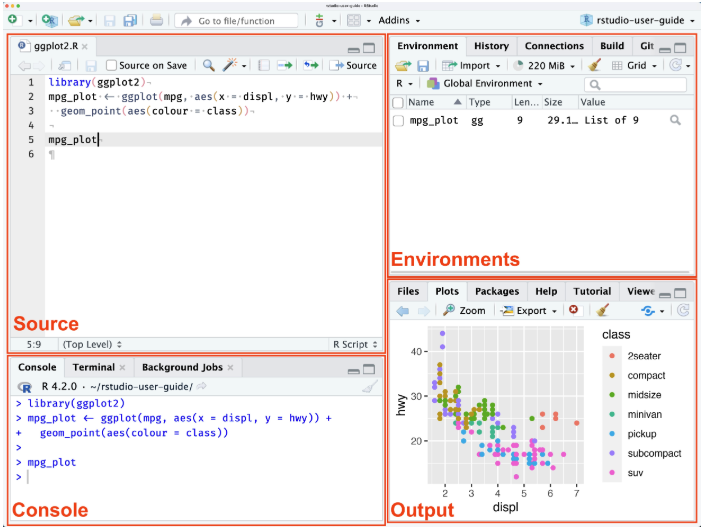
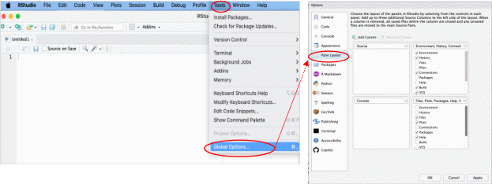

# Using *RStudio*: A (very) brief guide!

Now that you have both *R* and *RStudio* installed on your computer, you can begin using and interacting with *R* by opening the *RStudio* program. Open *RStudio* just as you would any program, by clicking on its icon (if you created a Desktop shortcut) or by searching for “RStudio” in your *Menu* of installed programs (in Windows this would be your *Start Menu*). 

#### Layout

*RStudio* has four main panes each in a quadrant of your screen. You can set what appears in each pane (through **Tools →  Options** menu on Windows, **RStudio/Preference** on MacOS, and **Tools → Global Options** on Linux (Linux Mint)), but the default shows:

-   `Console` (bottom left)
-   `Source` editor (top left)
-   Environment, History, Connections, etc. (top right), and
-   Plots, Files, Packages, Help, Viewer, etc. (bottom right).

Each pane can be minimized or maximized within its column by clicking the minimize/maximize buttons - you can also see if a pane is collapsed (and not visible) in this way.

#### Customising the Layout

You can change the layout of the panes, and their arrangement, to something you prefer by modifying these setting within **Tools → Global Options → Pane Layout** (Linux Mint). 

Does the default Light theme *RStudio* burn your retinas? You can also change the:

-  RStudio theme
-  Editor font and size, and
-  Editor theme

in **Tools → Global Options → Appearance**. 

