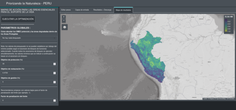

RShiny - the Graphical User Interface (GUI)
===========================================

Some new text that is really important.
*Test edit 2*
Di test

The  ELSA national tools you may have seen or used on-line are built using *RShiny*, and those we will be setting up to run locally on your computer during this workshop also use *RShiny*. *RShiny* is an *R* package that allows users to create interactive web applications directly from *R* code without the need for specialist web programming skills - meaning that in a nutshell, users can build/run functional web applications by simply opening the application in their web browser (Chrome, Firefox, Safari, etc). Some of the key features of *RShiny* are:

-   It provides a web application framework for *R*, allowing for interactive app development.
-   Includes reactive programming, allowing for automatically updating of outputs when inputs change.
-   It integrates with other *R* libraries, working seamlessly with with the `tidyverse <https://www.tidyverse.org/>`_ (e.g., *ggplot2*, *dplyr*, *readr*, etc.) *leaflet*, *shinyWidgets*, *terra*, and other *R* libraries.
-   Apps can be deployed on Web and hosted on `ShinyApps.io <https://www.shinyapps.io/>`_, `RStudio Connect <https://posit.co/products/enterprise/connect/>`_, or on private servers (for example, one of the tools for Peru seen below).

|

.. note:: 
    
    We run the various national *ELSA*, *Prioritizing Nature Webtools*, and other related web tools on private and secure UNICC infrastructure running on servers based in `GDPR (General Data Protection Regulation) <https://gdpr-info.eu/>`_ compliant locales.

